# Configuration System

This document describes how Lien manages configuration including loading, validation, migration, and the introduction of ConfigService.

## Configuration Architecture

```mermaid
graph TB
    subgraph "User Interface"
        INIT[lien init]
        EDIT[Manual Edit]
        UPGRADE[lien init --upgrade]
    end
    
    subgraph "ConfigService"
        LOAD[load()]
        SAVE[save()]
        MIGRATE[migrate()]
        VALIDATE[validate()]
        EXISTS[exists()]
    end
    
    subgraph "Core Logic"
        LOADER[loader.ts<br/><i>deprecated</i>]
        MIGRATION[migration.ts]
        MERGE[merge.ts]
        SCHEMA[schema.ts]
    end
    
    subgraph "Storage"
        CONFIG_FILE[.lien.config.json]
        BACKUP[.lien.config.json.v0.2.0.backup]
    end
    
    subgraph "Consumers"
        INDEXER[Indexer]
        MCP_SERVER[MCP Server]
        CLI_COMMANDS[CLI Commands]
    end
    
    %% User actions
    INIT --> SAVE
    EDIT --> CONFIG_FILE
    UPGRADE --> LOAD
    UPGRADE --> SAVE
    
    %% ConfigService operations
    LOAD --> LOADER
    LOAD --> MIGRATION
    LOAD --> VALIDATE
    LOAD --> MERGE
    SAVE --> VALIDATE
    SAVE --> CONFIG_FILE
    MIGRATE --> MIGRATION
    MIGRATE --> BACKUP
    MIGRATE --> CONFIG_FILE
    EXISTS --> CONFIG_FILE
    
    %% Core dependencies
    LOADER --> SCHEMA
    MIGRATION --> SCHEMA
    MERGE --> SCHEMA
    VALIDATE --> SCHEMA
    
    %% Consumers
    INDEXER --> LOAD
    MCP_SERVER --> LOAD
    CLI_COMMANDS --> LOAD
    CLI_COMMANDS --> EXISTS
    
    %% Styling
    classDef userClass fill:#e1f5ff,stroke:#01579b,stroke-width:2px
    classDef serviceClass fill:#e8f5e9,stroke:#1b5e20,stroke-width:2px
    classDef coreClass fill:#fff3e0,stroke:#e65100,stroke-width:2px
    classDef storageClass fill:#f3e5f5,stroke:#4a148c,stroke-width:2px
    classDef consumerClass fill:#fce4ec,stroke:#880e4f,stroke-width:2px
    
    class INIT,EDIT,UPGRADE userClass
    class LOAD,SAVE,MIGRATE,VALIDATE,EXISTS serviceClass
    class LOADER,MIGRATION,MERGE,SCHEMA coreClass
    class CONFIG_FILE,BACKUP storageClass
    class INDEXER,MCP_SERVER,CLI_COMMANDS consumerClass
```

## Config Migration Flow

```mermaid
sequenceDiagram
    participant User
    participant ConfigService
    participant MigrationLogic
    participant FileSystem
    
    User->>ConfigService: load(rootDir)
    ConfigService->>FileSystem: Read .lien.config.json
    FileSystem-->>ConfigService: Config content (JSON)
    
    ConfigService->>ConfigService: Parse JSON
    ConfigService->>ConfigService: needsMigration(config)?
    
    alt Needs Migration (v0.2.0 format)
        ConfigService->>User: Log: "🔄 Migrating config..."
        ConfigService->>MigrationLogic: migrateConfig(oldConfig)
        
        rect rgb(255, 243, 224)
            Note over MigrationLogic: Transform Structure
            MigrationLogic->>MigrationLogic: Extract core settings
            MigrationLogic->>MigrationLogic: Extract MCP settings
            MigrationLogic->>MigrationLogic: Convert indexing → frameworks
            MigrationLogic->>MigrationLogic: Remove test patterns from exclude
            MigrationLogic->>MigrationLogic: Create "generic" framework
        end
        
        MigrationLogic-->>ConfigService: New config (v0.3.0)
        
        ConfigService->>ConfigService: validate(newConfig)
        
        alt Validation passes
            ConfigService->>FileSystem: Copy to .lien.config.json.v0.2.0.backup
            ConfigService->>FileSystem: Write new config to .lien.config.json
            ConfigService->>User: Log: "✅ Migration complete!"
            ConfigService-->>User: Return new config
        else Validation fails
            ConfigService->>User: Throw ConfigError
        end
        
    else Modern format (v0.3.0+)
        ConfigService->>ConfigService: Merge with defaults
        ConfigService->>ConfigService: validate(mergedConfig)
        
        alt Validation passes
            ConfigService-->>User: Return merged config
        else Validation fails
            ConfigService->>User: Throw ConfigError
        end
    end
```



## Validation Flow

```mermaid
flowchart TD
    START[validate config]
    CHECK_TYPE{Is object?}
    CHECK_VERSION{Has version?}
    CHECK_FORMAT{Has frameworks<br/>or indexing?}
    
    subgraph "Modern Config Validation"
        VAL_CORE[Validate core settings]
        VAL_MCP[Validate MCP settings]
        VAL_GIT[Validate git detection]
        VAL_WATCH[Validate file watching]
        VAL_FRAMEWORKS[Validate frameworks array]
    end
    
    subgraph "Legacy Config Validation"
        VAL_INDEXING[Validate indexing settings]
        VAL_MCP_LEG[Validate MCP settings]
        WARN_LEGACY[Add warning: Use legacy format]
    end
    
    subgraph "Field Validation"
        CHUNK_SIZE{chunkSize > 0?}
        CONCURRENCY{1 ≤ concurrency ≤ 16?}
        PORT{1024 ≤ port ≤ 65535?}
        TRANSPORT{stdio or socket?}
        PATH{Path relative?}
    end
    
    COLLECT_ERRORS[Collect all errors]
    COLLECT_WARNINGS[Collect all warnings]
    BUILD_RESULT[Build ValidationResult]
    RETURN{errors.length = 0?}
    VALID[Return: valid = true]
    INVALID[Return: valid = false]
    
    START --> CHECK_TYPE
    CHECK_TYPE -->|No| INVALID
    CHECK_TYPE -->|Yes| CHECK_VERSION
    CHECK_VERSION -->|No| INVALID
    CHECK_VERSION -->|Yes| CHECK_FORMAT
    
    CHECK_FORMAT -->|frameworks| VAL_CORE
    CHECK_FORMAT -->|indexing| VAL_INDEXING
    CHECK_FORMAT -->|Neither| INVALID
    
    VAL_CORE --> VAL_MCP
    VAL_MCP --> VAL_GIT
    VAL_GIT --> VAL_WATCH
    VAL_WATCH --> VAL_FRAMEWORKS
    VAL_FRAMEWORKS --> COLLECT_ERRORS
    
    VAL_INDEXING --> VAL_MCP_LEG
    VAL_MCP_LEG --> WARN_LEGACY
    WARN_LEGACY --> COLLECT_ERRORS
    
    VAL_CORE -.-> CHUNK_SIZE
    VAL_CORE -.-> CONCURRENCY
    VAL_MCP -.-> PORT
    VAL_MCP -.-> TRANSPORT
    VAL_FRAMEWORKS -.-> PATH
    
    COLLECT_ERRORS --> COLLECT_WARNINGS
    COLLECT_WARNINGS --> BUILD_RESULT
    BUILD_RESULT --> RETURN
    RETURN -->|Yes| VALID
    RETURN -->|No| INVALID
    
    style VALID fill:#c8e6c9
    style INVALID fill:#ffcdd2
```



## Configuration Schema Evolution

### v0.2.0 (Legacy)

```json
{
  "version": "0.2.0",
  "indexing": {
    "include": ["**/*.{ts,tsx,js,jsx}"],
    "exclude": ["**/node_modules/**", "**/*.test.ts"],
    "chunkSize": 75,
    "chunkOverlap": 10,
    "concurrency": 4,
    "embeddingBatchSize": 50,
    "indexTests": true,
    "useImportAnalysis": true
  },
  "mcp": {...},
  "gitDetection": {...},
  "fileWatching": {...}
}
```

**Problems:**
- Test files mixed with exclude patterns
- Flat structure, no framework support
- No monorepo support

### v0.3.0 (Modern)

```json
{
  "version": "0.3.0",
  "core": {
    "chunkSize": 75,
    "chunkOverlap": 10,
    "concurrency": 4,
    "embeddingBatchSize": 50
  },
  "mcp": {...},
  "gitDetection": {...},
  "fileWatching": {...},
  "frameworks": [
    {
      "name": "nodejs",
      "path": ".",
      "enabled": true,
      "config": {
        "include": ["**/*.{ts,tsx,js,jsx}"],
        "exclude": ["**/node_modules/**", "**/dist/**"],
        "testPatterns": {
          "directories": ["**/__tests__/**"],
          "extensions": [".test.", ".spec."],
          "prefixes": [],
          "suffixes": ["_test", ".test"],
          "frameworks": ["jest", "vitest"]
        }
      }
    }
  ]
}
```

**Improvements:**
- Framework-based organization
- Clear separation of concerns (core vs framework settings)
- Explicit test pattern configuration
- Monorepo support via framework paths

## ConfigService API

### Core Methods

```typescript
class ConfigService {
  // Loading
  async load(rootDir: string): Promise<LienConfig>
  async exists(rootDir: string): Promise<boolean>
  
  // Saving
  async save(rootDir: string, config: LienConfig): Promise<void>
  
  // Migration
  async migrate(rootDir: string): Promise<MigrationResult>
  needsMigration(config: unknown): boolean
  
  // Validation
  validate(config: unknown): ValidationResult
  validatePartial(config: Partial<LienConfig>): ValidationResult
}
```

### Usage Examples

#### Loading with Auto-Migration

```typescript
const service = new ConfigService();
const config = await service.load('/path/to/project');
// Automatically migrates if needed
// Validates and merges with defaults
// Throws ConfigError if invalid
```

#### Validating User Input

```typescript
const userInput = {
  core: {
    chunkSize: 100,
    concurrency: 8
  }
};

const result = service.validatePartial(userInput);
if (!result.valid) {
  console.error('Invalid config:', result.errors);
  // ["concurrency must be between 1 and 16"]
}

if (result.warnings.length > 0) {
  console.warn('Warnings:', result.warnings);
}
```

#### Creating and Saving Config

```typescript
const config: LienConfig = {
  ...defaultConfig,
  core: {
    ...defaultConfig.core,
    chunkSize: 100
  }
};

await service.save('/path/to/project', config);
// Validates before saving
// Throws ConfigError if invalid
// Writes formatted JSON
```

## Validation Rules

### Core Settings

| Field | Type | Constraint | Warning |
|-------|------|------------|---------|
| chunkSize | number | > 0 | < 50: too small<br/>> 500: too large |
| chunkOverlap | number | ≥ 0 | - |
| concurrency | number | 1-16 | - |
| embeddingBatchSize | number | > 0 | > 100: may cause memory issues |

### MCP Settings

| Field | Type | Constraint |
|-------|------|------------|
| port | number | 1024-65535 |
| transport | string | "stdio" \| "socket" |
| autoIndexOnFirstRun | boolean | - |

### Git Detection

| Field | Type | Constraint | Warning |
|-------|------|------------|---------|
| enabled | boolean | - | - |
| pollIntervalMs | number | ≥ 100 | < 1000: may impact performance |

### File Watching

| Field | Type | Constraint | Warning |
|-------|------|------------|---------|
| enabled | boolean | - | - |
| debounceMs | number | ≥ 0 | < 100: may cause excessive reindexing |

### Frameworks

| Field | Type | Constraint |
|-------|------|------------|
| name | string | required |
| path | string | required, must be relative |
| enabled | boolean | required |
| config.include | string[] | required |
| config.exclude | string[] | required |
| config.testPatterns | object | required |

## Error Handling

### ConfigError Types

```typescript
// File not found
throw new ConfigError(
  'Failed to parse config file: Invalid JSON syntax',
  { path: configPath, originalError: error.message }
);

// Validation failed
throw new ConfigError(
  `Invalid configuration:\n${errors.join('\n')}`,
  { errors, warnings }
);

// Migration failed
throw new ConfigError(
  `Migration produced invalid configuration:\n${errors.join('\n')}`,
  { errors }
);
```

### Graceful Degradation

```typescript
// Config doesn't exist → Use defaults
const config = await service.load(rootDir);
// Returns defaultConfig if file not found

// Invalid but fixable → Warn and continue
const result = service.validate(config);
if (!result.valid) {
  throw new Error(); // Hard fail
}
if (result.warnings.length > 0) {
  console.warn(result.warnings); // Soft warning
}
```

## Migration Strategy

### Backward Compatibility

The migration system ensures smooth upgrades:

1. **Detect** old format via `needsMigration()`
2. **Transform** structure via `migrateConfig()`
3. **Backup** original as `.lien.config.json.v0.2.0.backup`
4. **Validate** new config
5. **Write** new config
6. **Log** success message

### Fallback Handling

```typescript
// During indexing, support both formats
const chunkSize = isModernConfig(config)
  ? config.core.chunkSize
  : isLegacyConfig(config)
    ? config.indexing.chunkSize
    : 75; // Default fallback
```

## Testing Strategy

The ConfigService has comprehensive test coverage:

- ✅ Loading existing configs
- ✅ Loading non-existent configs (defaults)
- ✅ Auto-migration workflow
- ✅ Validation (valid, invalid, warnings)
- ✅ Saving with validation
- ✅ Partial validation
- ✅ Integration workflows

**Test Results:** 33/33 passing (100% coverage on ConfigService logic)

