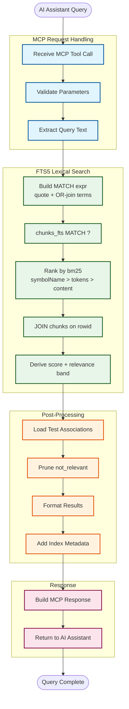
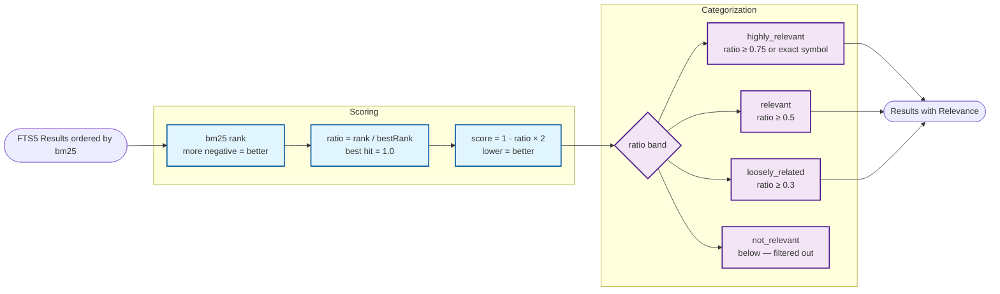
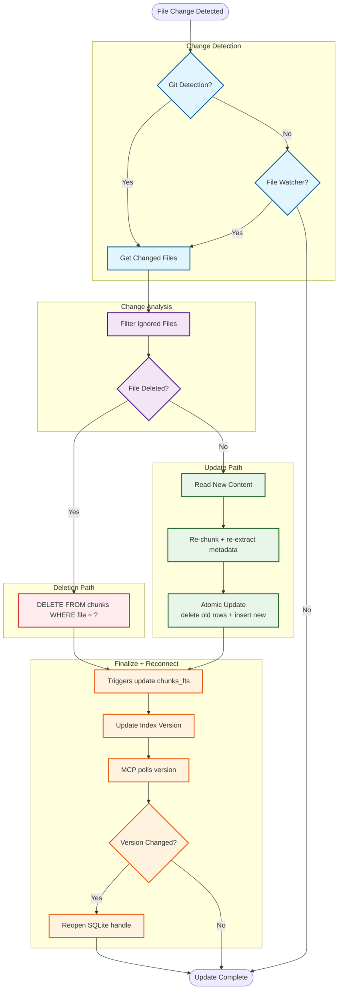

# Data Flow

This document illustrates how data flows through Lien during indexing and searching operations. Storage is a local SQLite database; there are no embeddings or vectors (see [ADR-011](decisions/0011-sqlite-structural-store-fts5-lexical-search.md)).

## Indexing data flow

Indexing parses source files into chunks, enriches them with complexity and dependency metadata, and writes them to the SQLite `chunks` table. FTS5 index rows are maintained automatically by triggers on `chunks`.


```mermaid
flowchart TB
    START([User runs 'lien index'])

    subgraph "Configuration Loading"
        LOAD_CONFIG[Load Configuration]
        DETECT_FW[Detect Ecosystems]
        MERGE_CONFIG[Merge with Defaults]
    end

    subgraph "File Discovery"
        SCAN_START[Start File Scanning]
        READ_GITIGNORE[Read .gitignore]
        APPLY_PATTERNS[Apply Include/Exclude Patterns]
        FILTER_FRAMEWORK[Apply Ecosystem Exclude Patterns]
        FILE_LIST[Generate File List]
    end

    subgraph "Test Association (Pass 1 + Pass 2)"
        CONVENTION_DETECT[Convention-Based Detection]
        IMPORT_ANALYSIS[Import Analysis]
        ASSOC_MAP[Build Association Map]
    end

    subgraph "File Processing (Concurrent)"
        READ_FILE[Read File Content]
        DETECT_LANG[Detect Language]
        CHUNK_FILE[Chunk into Segments AST]
        EXTRACT_SYMBOLS[Extract Symbols + Imports]
        COMPLEXITY[Compute Complexity Metrics]
        ADD_METADATA[Add Metadata + Test Assoc]
    end

    subgraph "SQLite Storage (SqliteBackend)"
        SERIALIZE[Serialize chunk → row]
        INSERT[INSERT INTO chunks]
        FTS_SYNC[Triggers sync chunks_fts]
        UPDATE_VERSION[Write Version File]
    end

    END([Indexing Complete])

    %% Main Flow
    START --> LOAD_CONFIG
    LOAD_CONFIG --> DETECT_FW
    DETECT_FW --> MERGE_CONFIG
    MERGE_CONFIG --> SCAN_START

    SCAN_START --> READ_GITIGNORE
    READ_GITIGNORE --> APPLY_PATTERNS
    APPLY_PATTERNS --> FILTER_FRAMEWORK
    FILTER_FRAMEWORK --> FILE_LIST

    FILE_LIST --> CONVENTION_DETECT
    CONVENTION_DETECT --> IMPORT_ANALYSIS
    IMPORT_ANALYSIS --> ASSOC_MAP

    ASSOC_MAP --> READ_FILE
    READ_FILE --> DETECT_LANG
    DETECT_LANG --> CHUNK_FILE
    CHUNK_FILE --> EXTRACT_SYMBOLS
    EXTRACT_SYMBOLS --> COMPLEXITY
    COMPLEXITY --> ADD_METADATA

    ADD_METADATA --> SERIALIZE
    SERIALIZE --> INSERT
    INSERT --> FTS_SYNC
    FTS_SYNC --> UPDATE_VERSION
    UPDATE_VERSION --> END

    %% Styling
    classDef configClass fill:#e1f5ff,stroke:#01579b,stroke-width:2px
    classDef scanClass fill:#f3e5f5,stroke:#4a148c,stroke-width:2px
    classDef testClass fill:#fff3e0,stroke:#e65100,stroke-width:2px
    classDef processClass fill:#e8f5e9,stroke:#1b5e20,stroke-width:2px
    classDef storageClass fill:#fff9c4,stroke:#f57f17,stroke-width:2px

    class LOAD_CONFIG,DETECT_FW,MERGE_CONFIG configClass
    class SCAN_START,READ_GITIGNORE,APPLY_PATTERNS,FILTER_FRAMEWORK,FILE_LIST scanClass
    class CONVENTION_DETECT,IMPORT_ANALYSIS,ASSOC_MAP testClass
    class READ_FILE,DETECT_LANG,CHUNK_FILE,EXTRACT_SYMBOLS,COMPLEXITY,ADD_METADATA processClass
    class SERIALIZE,INSERT,FTS_SYNC,UPDATE_VERSION storageClass
```

## Search data flow

The `search_code` / `find_similar` tools run FTS5/BM25 lexical search. The query text is turned into an FTS5 MATCH expression, matched against the FTS index, ranked by BM25, and mapped back to results, with no embedding step.


```mermaid
flowchart TB
    START([AI Assistant Query])

    subgraph "MCP Request Handling"
        RECEIVE[Receive MCP Tool Call]
        VALIDATE[Validate Parameters]
        EXTRACT[Extract Query Text]
    end

    subgraph "FTS5 Lexical Search"
        BUILD_MATCH[Build MATCH expr<br/>quote + OR-join terms]
        FTS_MATCH[chunks_fts MATCH ?]
        BM25[Rank by bm25<br/>symbolName &gt; tokens &gt; content]
        JOIN[JOIN chunks on rowid]
        BAND[Derive score + relevance band]
    end

    subgraph "Post-Processing"
        LOAD_TEST_ASSOC[Load Test Associations]
        PRUNE[Prune not_relevant]
        FORMAT_RESULTS[Format Results]
        ADD_INDEX_INFO[Add Index Metadata]
    end

    subgraph "Response"
        BUILD_RESPONSE[Build MCP Response]
        RETURN[Return to AI Assistant]
    end

    END([Query Complete])

    START --> RECEIVE
    RECEIVE --> VALIDATE
    VALIDATE --> EXTRACT
    EXTRACT --> BUILD_MATCH

    BUILD_MATCH --> FTS_MATCH
    FTS_MATCH --> BM25
    BM25 --> JOIN
    JOIN --> BAND

    BAND --> LOAD_TEST_ASSOC
    LOAD_TEST_ASSOC --> PRUNE
    PRUNE --> FORMAT_RESULTS
    FORMAT_RESULTS --> ADD_INDEX_INFO

    ADD_INDEX_INFO --> BUILD_RESPONSE
    BUILD_RESPONSE --> RETURN
    RETURN --> END

    %% Styling
    classDef mcpClass fill:#e1f5ff,stroke:#01579b,stroke-width:2px
    classDef searchClass fill:#e8f5e9,stroke:#1b5e20,stroke-width:2px
    classDef processClass fill:#fff3e0,stroke:#e65100,stroke-width:2px
    classDef responseClass fill:#fce4ec,stroke:#880e4f,stroke-width:2px

    class RECEIVE,VALIDATE,EXTRACT mcpClass
    class BUILD_MATCH,FTS_MATCH,BM25,JOIN,BAND searchClass
    class LOAD_TEST_ASSOC,PRUNE,FORMAT_RESULTS,ADD_INDEX_INFO processClass
    class BUILD_RESPONSE,RETURN responseClass
```

### Structural query flow

The structural tools (`get_files_context`, `get_dependents`, `list_functions`, `get_complexity`) do not touch FTS5 at all: they scan or look up rows in `chunks` with indexed SQL and post-process in JS (dependency graph, complexity enrichment). `get_files_context` is the hot path: an indexed `SELECT ... WHERE file IN (...)` backed by `idx_chunks_file`.

## Relevance scoring

FTS5 lexical search attaches a `score` and a `relevance` category to each result, both derived from the BM25 rank.


```mermaid
flowchart LR
    START([FTS5 Results ordered by bm25])

    subgraph "Scoring"
        RANK[bm25 rank<br/>more negative = better]
        RATIO[ratio = rank / bestRank<br/>best hit = 1.0]
        SCORE[score = 1 - ratio × 2<br/>lower = better]
    end

    subgraph "Categorization"
        BANDS{ratio band}
        HIGH[highly_relevant<br/>ratio ≥ 0.75 or exact symbol]
        REL[relevant<br/>ratio ≥ 0.5]
        LOOSE[loosely_related<br/>ratio ≥ 0.3]
        NOT[not_relevant<br/>below — filtered out]
    end

    END([Results with Relevance])

    START --> RANK
    RANK --> RATIO
    RATIO --> SCORE
    SCORE --> BANDS
    BANDS --> HIGH
    BANDS --> REL
    BANDS --> LOOSE
    BANDS --> NOT
    HIGH --> END
    REL --> END
    LOOSE --> END

    classDef scoreClass fill:#e1f5ff,stroke:#01579b,stroke-width:2px
    classDef catClass fill:#f3e5f5,stroke:#4a148c,stroke-width:2px
    class RANK,RATIO,SCORE scoreClass
    class BANDS,HIGH,REL,LOOSE,NOT catClass
```

Because bands are relative to the best hit in each result set, the top result is always `highly_relevant`. Relevance measures **keyword match strength**, not semantic similarity: a match means the query terms appear in the code or its comments.

## Incremental update data flow

When files change, only modified files are reindexed. The FTS5 external-content index is kept consistent by the `AFTER INSERT/UPDATE/DELETE` triggers on `chunks`.


```mermaid
flowchart TB
    START([File Change Detected])

    subgraph "Change Detection"
        GIT_DETECT{Git Detection?}
        FILE_WATCH{File Watcher?}
        GET_CHANGED[Get Changed Files]
    end

    subgraph "Change Analysis"
        FILTER_IGNORED[Filter Ignored Files]
        CHECK_DELETED{File Deleted?}
    end

    subgraph "Deletion Path"
        DELETE_CHUNKS[DELETE FROM chunks WHERE file = ?]
    end

    subgraph "Update Path"
        READ_NEW[Read New Content]
        RECHUNK[Re-chunk + re-extract metadata]
        ATOMIC_UPDATE[Atomic Update<br/>delete old rows + insert new]
    end

    subgraph "Finalize + Reconnect"
        FTS_TRIGGERS[Triggers update chunks_fts]
        UPDATE_VERSION[Update Index Version]
        VERSION_POLL[MCP polls version]
        RECONNECT{Version Changed?}
        RELOAD_INDEX[Reopen SQLite handle]
    end

    END([Update Complete])

    START --> GIT_DETECT
    GIT_DETECT -->|Yes| GET_CHANGED
    GIT_DETECT -->|No| FILE_WATCH
    FILE_WATCH -->|Yes| GET_CHANGED
    FILE_WATCH -->|No| END

    GET_CHANGED --> FILTER_IGNORED
    FILTER_IGNORED --> CHECK_DELETED

    CHECK_DELETED -->|Yes| DELETE_CHUNKS
    DELETE_CHUNKS --> FTS_TRIGGERS

    CHECK_DELETED -->|No| READ_NEW
    READ_NEW --> RECHUNK
    RECHUNK --> ATOMIC_UPDATE
    ATOMIC_UPDATE --> FTS_TRIGGERS

    FTS_TRIGGERS --> UPDATE_VERSION
    UPDATE_VERSION --> VERSION_POLL
    VERSION_POLL --> RECONNECT
    RECONNECT -->|Yes| RELOAD_INDEX
    RECONNECT -->|No| END
    RELOAD_INDEX --> END

    classDef detectClass fill:#e1f5ff,stroke:#01579b,stroke-width:2px
    classDef analysisClass fill:#f3e5f5,stroke:#4a148c,stroke-width:2px
    classDef deleteClass fill:#ffebee,stroke:#c62828,stroke-width:2px
    classDef updateClass fill:#e8f5e9,stroke:#1b5e20,stroke-width:2px
    classDef reconnectClass fill:#fff3e0,stroke:#e65100,stroke-width:2px

    class GIT_DETECT,FILE_WATCH,GET_CHANGED detectClass
    class FILTER_IGNORED,CHECK_DELETED analysisClass
    class DELETE_CHUNKS deleteClass
    class READ_NEW,RECHUNK,ATOMIC_UPDATE updateClass
    class FTS_TRIGGERS,UPDATE_VERSION,VERSION_POLL,RECONNECT,RELOAD_INDEX reconnectClass
```

## Data transformations

### File → Chunks

AST chunking keeps functions and classes whole; a line-based fallback (fixed size + overlap) is used for unsupported languages, very large files, or parse errors. See [Indexing Flow](./indexing-flow.md) → Chunking strategy for the worked example and the traverser mechanics.

### Chunk → Row

Each chunk is flattened to a row in the `chunks` table: scalar columns (file,
startLine, endLine, symbolName, symbolType, signature, complexity metrics, …) plus
JSON columns for arrays/maps (imports, exports, callSites, importedSymbols, …).
`symbolTokens` is an identifier-split copy of the symbol name
(`parseImportStatement` → `parse import statement`) so a keyword search for `parse`
matches the symbol.

### Query → Results

```
Query text: "authenticate session token"
    ↓ [orQuery: quote each term, OR-join]
FTS5 MATCH: "authenticate" OR "session" OR "token"
    ↓ [chunks_fts MATCH, ORDER BY bm25 ASC]
Ranked rows (best = most-negative bm25)
    ↓ [map to score + relevance band, prune not_relevant]
Top-N results with metadata
```

## Data storage

### SQLite schema (`chunks`)

```
chunks (
  id INTEGER PRIMARY KEY,        -- rowid; referenced by chunks_fts content_rowid
  file TEXT NOT NULL,            -- backed by idx_chunks_file (get_files_context hot path)
  startLine INTEGER, endLine INTEGER,
  type TEXT, language TEXT,
  symbolName TEXT, symbolType TEXT, parentClass TEXT, signature TEXT,
  symbolTokens TEXT,            -- identifier-split copy of symbolName (for FTS5)
  complexity INTEGER, cognitiveComplexity INTEGER,
  halsteadVolume REAL, halsteadDifficulty REAL, halsteadEffort REAL, halsteadBugs REAL,
  content TEXT NOT NULL DEFAULT '',
  functionNames, classNames, interfaceNames, parameters,
  imports, exports, importedSymbols, callSites   -- JSON text columns
)
```

```
chunks_fts  -- FTS5 external-content virtual table (content='chunks')
  columns: symbolName, symbolTokens, content
  tokenize: porter unicode61
  kept in sync by AFTER INSERT/UPDATE/DELETE triggers on chunks
```

`startLine`/`endLine` are `INTEGER` (the structural-store spike stored them as REAL; fixed in production). The multi-tenant `ChunkMetadata` fields (`repoId`, `orgId`, `branch`, `commitSha`) were never stored as columns and have since been removed entirely; none were ever wired to a write site. Cross-repo MCP mode itself (the `crossRepo`/`repoIds` tool parameters, `supportsCrossRepo`, `scanCrossRepo`) was removed; it was never implemented in the SQLite era.

### Version file

```json
{
  "version": 123456789,
  "timestamp": "2026-07-04T20:00:00.000Z",
  "config": { "chunkSize": 75, "chunkOverlap": 10 }
}
```

Purpose: lets the MCP server detect index changes and reopen its SQLite handle.

## Error handling

### Graceful degradation

```
File Processing Error:
    ├─ Binary file detected      → Skip file, continue
    ├─ Parse error (malformed)   → Log warning, fall back to line-based / skip
    └─ Database write failure    → Throw error (critical)
```

### Transaction safety

Atomic file updates run inside a single SQLite transaction:
```
1. Begin transaction
2. DELETE old rows for the file (triggers remove their FTS entries)
3. INSERT new rows (triggers add their FTS entries)
4. Commit

If any step fails → Rollback → File remains in its previous state
```

## Performance optimizations

- **Indexed file lookup**: `get_files_context` uses `idx_chunks_file` for a sub-millisecond `WHERE file IN (...)` scan: the most frequent (mandatory pre-edit) query.
- **Concurrent file processing**: `p-limit(concurrency)` parses files in parallel; the SQLite write is a fast synchronous step.
- **WAL journaling**: `journal_mode=WAL`, `synchronous=NORMAL`, and a `busy_timeout` let the MCP watcher and a concurrent CLI index share handles without immediate `SQLITE_BUSY` failures.
- **No model load**: there is no embedding model to download or keep resident.
