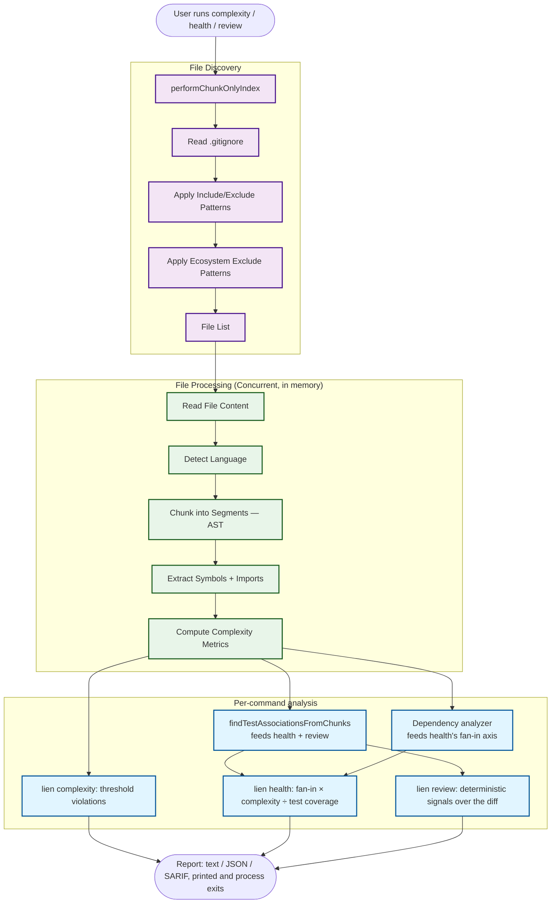
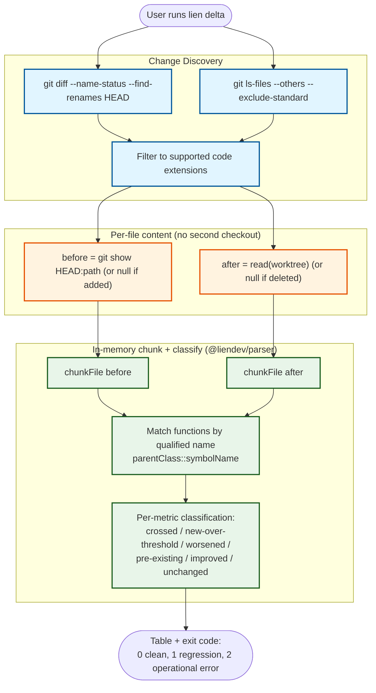

# Data Flow

> [!IMPORTANT]
> **Phase 5 (2026-09-01, commit `0de8ea52`) deleted the persisted SQLite index,
> FTS5 lexical search, the MCP server, and the file watcher.** Every diagram this
> document used to carry — indexing into a `chunks` table, `search_code`/`find_similar`
> FTS5/BM25 lookups, structural queries against indexed SQL, incremental reindexing
> kept in sync by triggers — described that now-deleted machinery and has been
> replaced below. There is no data at rest any more: every command parses the
> working tree fresh, on every invocation, and holds the result only in memory for
> the duration of that run.

This document illustrates how data flows through Lien's four commands (`lien complexity`, `lien health`, `lien review`, `lien delta`), all of which parse the working tree on demand rather than reading a stored index.

## Parse-and-analyze data flow

`lien complexity`, `lien health`, and `lien review` all start the same way: scan the repo, chunk every file with Tree-sitter, and compute metrics from the in-memory chunks. Nothing is written anywhere; the process holds the chunks for the run and exits.


```mermaid
flowchart TB
    START([User runs complexity / health / review])

    subgraph "File Discovery"
        SCAN_START[performChunkOnlyIndex]
        READ_GITIGNORE[Read .gitignore]
        APPLY_PATTERNS[Apply Include/Exclude Patterns]
        FILTER_ECOSYSTEM[Apply Ecosystem Exclude Patterns]
        FILE_LIST[File List]
    end

    subgraph "File Processing (Concurrent, in memory)"
        READ_FILE[Read File Content]
        DETECT_LANG[Detect Language]
        CHUNK_FILE[Chunk into Segments — AST]
        EXTRACT_SYMBOLS[Extract Symbols + Imports]
        COMPLEXITY[Compute Complexity Metrics]
    end

    subgraph "Per-command analysis"
        HEALTH_RANK[lien health: fan-in × complexity ÷ test coverage]
        REVIEW_SIGNALS[lien review: deterministic signals over the diff]
        COMPLEXITY_REPORT[lien complexity: threshold violations]
        TESTASSOC[findTestAssociationsFromChunks<br/>feeds health + review]
        DEPS[Dependency analyzer<br/>feeds health's fan-in axis]
    end

    REPORT([Report: text / JSON / SARIF, printed and process exits])

    START --> SCAN_START
    SCAN_START --> READ_GITIGNORE
    READ_GITIGNORE --> APPLY_PATTERNS
    APPLY_PATTERNS --> FILTER_ECOSYSTEM
    FILTER_ECOSYSTEM --> FILE_LIST

    FILE_LIST --> READ_FILE
    READ_FILE --> DETECT_LANG
    DETECT_LANG --> CHUNK_FILE
    CHUNK_FILE --> EXTRACT_SYMBOLS
    EXTRACT_SYMBOLS --> COMPLEXITY

    COMPLEXITY --> COMPLEXITY_REPORT
    COMPLEXITY --> TESTASSOC
    COMPLEXITY --> DEPS
    TESTASSOC --> HEALTH_RANK
    DEPS --> HEALTH_RANK
    TESTASSOC --> REVIEW_SIGNALS

    COMPLEXITY_REPORT --> REPORT
    HEALTH_RANK --> REPORT
    REVIEW_SIGNALS --> REPORT

    classDef scanClass fill:#f3e5f5,stroke:#4a148c,stroke-width:2px
    classDef processClass fill:#e8f5e9,stroke:#1b5e20,stroke-width:2px
    classDef analysisClass fill:#e1f5ff,stroke:#01579b,stroke-width:2px

    class SCAN_START,READ_GITIGNORE,APPLY_PATTERNS,FILTER_ECOSYSTEM,FILE_LIST scanClass
    class READ_FILE,DETECT_LANG,CHUNK_FILE,EXTRACT_SYMBOLS,COMPLEXITY processClass
    class HEALTH_RANK,REVIEW_SIGNALS,COMPLEXITY_REPORT,TESTASSOC,DEPS analysisClass
```

`lien review` additionally needs the diff itself (see below) to know which files and lines changed; it reuses the same repo-wide chunk pass for cross-file context (e.g. "does this literal still appear unconditionally elsewhere?").

## `lien delta`'s before/after diff flow

`lien delta` doesn't scan the whole repo — it diffs the working tree against `HEAD` (or `--base <ref>`), reads each changed file's before/after content directly (no second checkout), and chunks only those two strings. See [lien delta](./lien-delta.md) for the full command design.


```mermaid
flowchart TB
    START([User runs lien delta])

    subgraph "Change Discovery"
        DIFF[git diff --name-status --find-renames HEAD]
        UNTRACKED[git ls-files --others --exclude-standard]
        FILTER_EXT[Filter to supported code extensions]
    end

    subgraph "Per-file content (no second checkout)"
        BEFORE["before = git show HEAD:path (or null if added)"]
        AFTER["after = read(worktree) (or null if deleted)"]
    end

    subgraph "In-memory chunk + classify (@liendev/parser)"
        CHUNK_BEFORE[chunkFile before]
        CHUNK_AFTER[chunkFile after]
        MATCH[Match functions by qualified name<br/>parentClass::symbolName]
        CLASSIFY["Per-metric classification:<br/>crossed / new-over-threshold / worsened /<br/>pre-existing / improved / unchanged"]
    end

    REPORT([Table + exit code:<br/>0 clean, 1 regression, 2 operational error])

    START --> DIFF
    START --> UNTRACKED
    DIFF --> FILTER_EXT
    UNTRACKED --> FILTER_EXT
    FILTER_EXT --> BEFORE
    FILTER_EXT --> AFTER
    BEFORE --> CHUNK_BEFORE
    AFTER --> CHUNK_AFTER
    CHUNK_BEFORE --> MATCH
    CHUNK_AFTER --> MATCH
    MATCH --> CLASSIFY
    CLASSIFY --> REPORT

    classDef discoverClass fill:#e1f5ff,stroke:#01579b,stroke-width:2px
    classDef contentClass fill:#fff3e0,stroke:#e65100,stroke-width:2px
    classDef classifyClass fill:#e8f5e9,stroke:#1b5e20,stroke-width:2px

    class DIFF,UNTRACKED,FILTER_EXT discoverClass
    class BEFORE,AFTER contentClass
    class CHUNK_BEFORE,CHUNK_AFTER,MATCH,CLASSIFY classifyClass
```

## Data transformations

### File → Chunks

AST chunking keeps functions and classes whole; a line-based fallback (fixed size + overlap) is used for unsupported languages, very large files, or parse errors. One chunk per function/method, carrying `complexity` (cyclomatic), `cognitiveComplexity`, `halsteadEffort`, `halsteadBugs`, `symbolName`, `parentClass`, `signature`, `startLine`, and (repo-wide scans only) `imports`/`exports`/`callSites`.

### Chunks → Report

Nothing is flattened into a database row any more. `analyzeComplexityFromChunks` walks the in-memory `CodeChunk[]` directly and returns a `ComplexityReport`; `lien health` and `lien review` layer dependency counts, test associations, and (for review) signal findings on top of that same in-memory structure before formatting it as text/JSON/SARIF and printing it. The process exits when the report is printed — there is no row to persist and nothing left to keep in sync.

## Error handling: No-Data Honesty

A failed or empty parse must never format as a clean result — the same failure mode a stale or missing index used to produce, now produced by `performChunkOnlyIndex` returning `{ success: false }` instead of throwing. `describeScanFailure` (`packages/cli/src/utils/scan-failure.ts`) is the shared detector: `lien complexity` (gate-shaped) hard-errors on it, `lien health` (advisory) warns loudly at exit 0. See `CLAUDE.md`'s "No-Data Honesty" section.

```
File Processing Error:
    ├─ Binary file detected      → Skip file, continue
    ├─ Parse error (malformed)   → Log warning, fall back to line-based / skip
    └─ Zero files found to scan  → success: false, routed through describeScanFailure
```

## Performance

- **Concurrency**: parser-side file processing runs with bounded concurrency (default 4) during a scan.
- **No caching between runs**: every invocation re-parses whatever it needs from disk; there is no persisted structure to reuse across commands or across runs of the same command.
- **No model load, no index load**: nothing to download, nothing to warm up, nothing that can go stale — the tradeoff phase 5 made deliberately in exchange for losing search and cross-invocation caching.
