# Data Flow

This document illustrates how data flows through Lien during indexing and searching operations.

## Indexing Data Flow

The indexing flow transforms source code files into searchable vector embeddings.

```mermaid
flowchart TB
    START([User runs 'lien index'])
    
    subgraph "Configuration Loading"
        LOAD_CONFIG[Load Configuration]
        DETECT_FW[Detect Frameworks]
        MERGE_CONFIG[Merge with Defaults]
    end
    
    subgraph "File Discovery"
        SCAN_START[Start File Scanning]
        READ_GITIGNORE[Read .gitignore]
        APPLY_PATTERNS[Apply Include/Exclude Patterns]
        FILTER_FRAMEWORK[Filter by Framework Boundaries]
        FILE_LIST[Generate File List]
    end
    
    subgraph "Test Association (Pass 1)"
        CONVENTION_DETECT[Convention-Based Detection]
        PATTERN_MATCH[Match File Patterns]
        DIR_MATCH[Match Directory Patterns]
        ASSOC_MAP1[Build Association Map]
    end
    
    subgraph "Test Association (Pass 2)"
        IMPORT_ANALYSIS[Import Analysis]
        PARSE_IMPORTS[Parse Import Statements]
        RESOLVE_PATHS[Resolve File Paths]
        ASSOC_MAP2[Merge Association Map]
    end
    
    subgraph "File Processing (Concurrent)"
        READ_FILE[Read File Content]
        DETECT_LANG[Detect Language]
        CHUNK_FILE[Chunk into Segments]
        EXTRACT_SYMBOLS[Extract Symbols]
        ADD_METADATA[Add Metadata]
    end
    
    subgraph "Embedding Generation (Batched)"
        BATCH_CHUNKS[Batch Chunks]
        TOKENIZE[Tokenize Text]
        GENERATE_EMB[Generate Embeddings]
        NORMALIZE[Normalize Vectors]
    end
    
    subgraph "Vector Storage"
        PREP_INSERT[Prepare Insert]
        BATCH_INSERT[Batch Insert to LanceDB]
        UPDATE_INDEX[Update Index Version]
        WRITE_VERSION[Write Version File]
    end
    
    END([Indexing Complete])
    
    %% Main Flow
    START --> LOAD_CONFIG
    LOAD_CONFIG --> DETECT_FW
    DETECT_FW --> MERGE_CONFIG
    MERGE_CONFIG --> SCAN_START
    
    SCAN_START --> READ_GITIGNORE
    READ_GITIGNORE --> APPLY_PATTERNS
    APPLY_PATTERNS --> FILTER_FRAMEWORK
    FILTER_FRAMEWORK --> FILE_LIST
    
    FILE_LIST --> CONVENTION_DETECT
    CONVENTION_DETECT --> PATTERN_MATCH
    PATTERN_MATCH --> DIR_MATCH
    DIR_MATCH --> ASSOC_MAP1
    
    ASSOC_MAP1 --> IMPORT_ANALYSIS
    IMPORT_ANALYSIS --> PARSE_IMPORTS
    PARSE_IMPORTS --> RESOLVE_PATHS
    RESOLVE_PATHS --> ASSOC_MAP2
    
    ASSOC_MAP2 --> READ_FILE
    READ_FILE --> DETECT_LANG
    DETECT_LANG --> CHUNK_FILE
    CHUNK_FILE --> EXTRACT_SYMBOLS
    EXTRACT_SYMBOLS --> ADD_METADATA
    
    ADD_METADATA --> BATCH_CHUNKS
    BATCH_CHUNKS --> TOKENIZE
    TOKENIZE --> GENERATE_EMB
    GENERATE_EMB --> NORMALIZE
    
    NORMALIZE --> PREP_INSERT
    PREP_INSERT --> BATCH_INSERT
    BATCH_INSERT --> UPDATE_INDEX
    UPDATE_INDEX --> WRITE_VERSION
    WRITE_VERSION --> END
    
    %% Styling
    classDef configClass fill:#e1f5ff,stroke:#01579b,stroke-width:2px
    classDef scanClass fill:#f3e5f5,stroke:#4a148c,stroke-width:2px
    classDef testClass fill:#fff3e0,stroke:#e65100,stroke-width:2px
    classDef processClass fill:#e8f5e9,stroke:#1b5e20,stroke-width:2px
    classDef embedClass fill:#fce4ec,stroke:#880e4f,stroke-width:2px
    classDef storageClass fill:#fff9c4,stroke:#f57f17,stroke-width:2px
    
    class LOAD_CONFIG,DETECT_FW,MERGE_CONFIG configClass
    class SCAN_START,READ_GITIGNORE,APPLY_PATTERNS,FILTER_FRAMEWORK,FILE_LIST scanClass
    class CONVENTION_DETECT,PATTERN_MATCH,DIR_MATCH,ASSOC_MAP1,IMPORT_ANALYSIS,PARSE_IMPORTS,RESOLVE_PATHS,ASSOC_MAP2 testClass
    class READ_FILE,DETECT_LANG,CHUNK_FILE,EXTRACT_SYMBOLS,ADD_METADATA processClass
    class BATCH_CHUNKS,TOKENIZE,GENERATE_EMB,NORMALIZE embedClass
    class PREP_INSERT,BATCH_INSERT,UPDATE_INDEX,WRITE_VERSION storageClass
```



## Search Data Flow

The search flow transforms natural language queries into relevant code results.

```mermaid
flowchart TB
    START([AI Assistant Query])
    
    subgraph "MCP Request Handling"
        RECEIVE[Receive MCP Tool Call]
        VALIDATE[Validate Parameters]
        EXTRACT[Extract Query Text]
    end
    
    subgraph "Embedding Generation"
        CHECK_CACHE{Check Cache}
        CACHE_HIT[Cache Hit]
        TOKENIZE[Tokenize Query]
        GENERATE[Generate Embedding]
        STORE_CACHE[Store in Cache]
        GET_VECTOR[Get Query Vector]
    end
    
    subgraph "Vector Search"
        LOAD_INDEX[Load Vector Index]
        CALC_SIMILARITY[Calculate Cosine Similarity]
        RANK_RESULTS[Rank by Similarity]
        APPLY_LIMIT[Apply Result Limit]
    end
    
    subgraph "Post-Processing"
        FETCH_METADATA[Fetch Chunk Metadata]
        LOAD_TEST_ASSOC[Load Test Associations]
        FORMAT_RESULTS[Format Results]
        ADD_INDEX_INFO[Add Index Metadata]
    end
    
    subgraph "Response"
        BUILD_RESPONSE[Build MCP Response]
        RETURN[Return to AI Assistant]
    end
    
    END([Query Complete])
    
    %% Main Flow
    START --> RECEIVE
    RECEIVE --> VALIDATE
    VALIDATE --> EXTRACT
    EXTRACT --> CHECK_CACHE
    
    CHECK_CACHE -->|Hit| CACHE_HIT
    CHECK_CACHE -->|Miss| TOKENIZE
    CACHE_HIT --> GET_VECTOR
    TOKENIZE --> GENERATE
    GENERATE --> STORE_CACHE
    STORE_CACHE --> GET_VECTOR
    
    GET_VECTOR --> LOAD_INDEX
    LOAD_INDEX --> CALC_SIMILARITY
    CALC_SIMILARITY --> RANK_RESULTS
    RANK_RESULTS --> APPLY_LIMIT
    
    APPLY_LIMIT --> FETCH_METADATA
    FETCH_METADATA --> LOAD_TEST_ASSOC
    LOAD_TEST_ASSOC --> FORMAT_RESULTS
    FORMAT_RESULTS --> ADD_INDEX_INFO
    
    ADD_INDEX_INFO --> BUILD_RESPONSE
    BUILD_RESPONSE --> RETURN
    RETURN --> END
    
    %% Styling
    classDef mcpClass fill:#e1f5ff,stroke:#01579b,stroke-width:2px
    classDef embedClass fill:#f3e5f5,stroke:#4a148c,stroke-width:2px
    classDef searchClass fill:#e8f5e9,stroke:#1b5e20,stroke-width:2px
    classDef processClass fill:#fff3e0,stroke:#e65100,stroke-width:2px
    classDef responseClass fill:#fce4ec,stroke:#880e4f,stroke-width:2px
    
    class RECEIVE,VALIDATE,EXTRACT mcpClass
    class CHECK_CACHE,CACHE_HIT,TOKENIZE,GENERATE,STORE_CACHE,GET_VECTOR embedClass
    class LOAD_INDEX,CALC_SIMILARITY,RANK_RESULTS,APPLY_LIMIT searchClass
    class FETCH_METADATA,LOAD_TEST_ASSOC,FORMAT_RESULTS,ADD_INDEX_INFO processClass
    class BUILD_RESPONSE,RETURN responseClass
```



## Incremental Update Data Flow

When files change, only modified files are reindexed.


## Data Transformations

### File → Chunks

```
Source File (example.ts, 200 lines)
    ↓ [Chunker with size=75, overlap=10]
Chunks:
    - Chunk 1: lines 1-75
    - Chunk 2: lines 66-140 (overlaps with Chunk 1)
    - Chunk 3: lines 131-200 (overlaps with Chunk 2)
```

**Why Overlap?**
- Prevents context loss at chunk boundaries
- Ensures functions/classes spanning boundaries are captured
- Default overlap: 10 lines

### Code → Embeddings

```
Code Chunk:
"export function calculateTotal(items: Item[]): number {
  return items.reduce((sum, item) => sum + item.price, 0);
}"
    ↓ [Tokenization]
Tokens: ["export", "function", "calculate", "total", "(", "items", ...]
    ↓ [all-MiniLM-L6-v2 Model]
Embedding: Float32Array[384]
[0.023, -0.145, 0.891, ..., -0.234]
    ↓ [Normalization]
Normalized Vector (magnitude = 1.0)
```

### Query → Results

```
Natural Language Query:
"How do we calculate totals?"
    ↓ [Same Embedding Process]
Query Vector: Float32Array[384]
    ↓ [Cosine Similarity Search]
Similarity Scores:
    - Chunk A: 0.92 (calculateTotal function)
    - Chunk B: 0.85 (sumItems helper)
    - Chunk C: 0.78 (priceCalculator)
    ↓ [Rank & Limit]
Top 3 Results with Metadata
```

## Performance Optimizations

### Batch Processing

Instead of processing one at a time:
```
Sequential: File1 → Embed → Store → File2 → Embed → Store
   ❌ Slow (N × T time)

Batched: [File1, File2, ..., FileN] → Embed Batch → Store Batch
   ✅ Fast (T time + overhead)
```

### Embedding Cache

```
Query 1: "authentication logic"
    → Generate embedding (200ms)
    → Store in cache
    → Return results

Query 2: "authentication logic" (same query)
    → Check cache (1ms)
    → Return cached embedding
    → Return results
    
Speedup: 200x faster for repeated queries
```

### Concurrent File Processing

```
Single-threaded: File1 → File2 → File3 → File4
   ⏱️  4 × 2s = 8s

Concurrent (4 workers): [File1, File2, File3, File4]
   ⏱️  max(2s, 2s, 2s, 2s) = 2s

Speedup: 4x faster (with concurrency=4)
```

## Data Storage

### LanceDB Schema

```
Vector Table:
┌──────────────┬─────────────┬────────────┬─────────────┐
│ vector       │ content     │ file       │ startLine   │
│ (384 dims)   │ (string)    │ (string)   │ (int)       │
├──────────────┼─────────────┼────────────┼─────────────┤
│ [0.1, ...]   │ "function..." │ "app.ts"   │ 10          │
│ [0.2, ...]   │ "class..."    │ "user.ts"  │ 45          │
└──────────────┴─────────────┴────────────┴─────────────┘

Additional Metadata:
- endLine (int)
- language (string)
- isTest (boolean)
- relatedTests (string[])
- relatedSources (string[])
- symbols (object)
```

### Version File

```json
{
  "version": 123456789,
  "timestamp": "2025-11-16T20:00:00.000Z",
  "config": {
    "chunkSize": 75,
    "chunkOverlap": 10
  }
}
```

Purpose: Enables MCP server to detect index changes and reconnect.

## Error Handling

### Graceful Degradation

```
File Processing Error:
    ├─ Binary file detected
    │  └─ Skip file, continue with others
    ├─ Parse error (malformed code)
    │  └─ Log warning, skip file
    ├─ Embedding generation failure
    │  └─ Retry once, then skip
    └─ Database write failure
       └─ Throw error (critical)
```

### Transaction Safety

Atomic updates ensure consistency:
```
Update File:
1. Start transaction
2. Delete old chunks for file
3. Insert new chunks for file
4. Commit transaction

If any step fails → Rollback → File remains in old state
```

