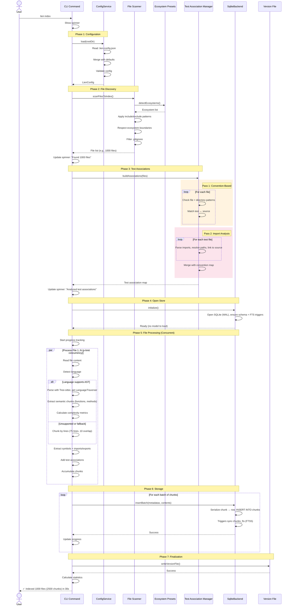
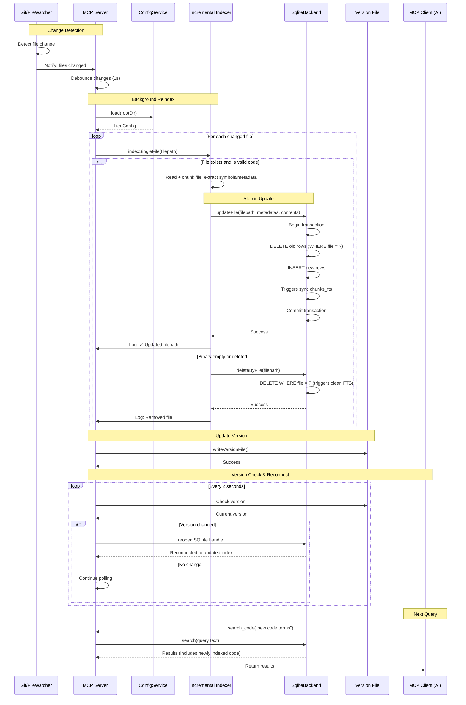
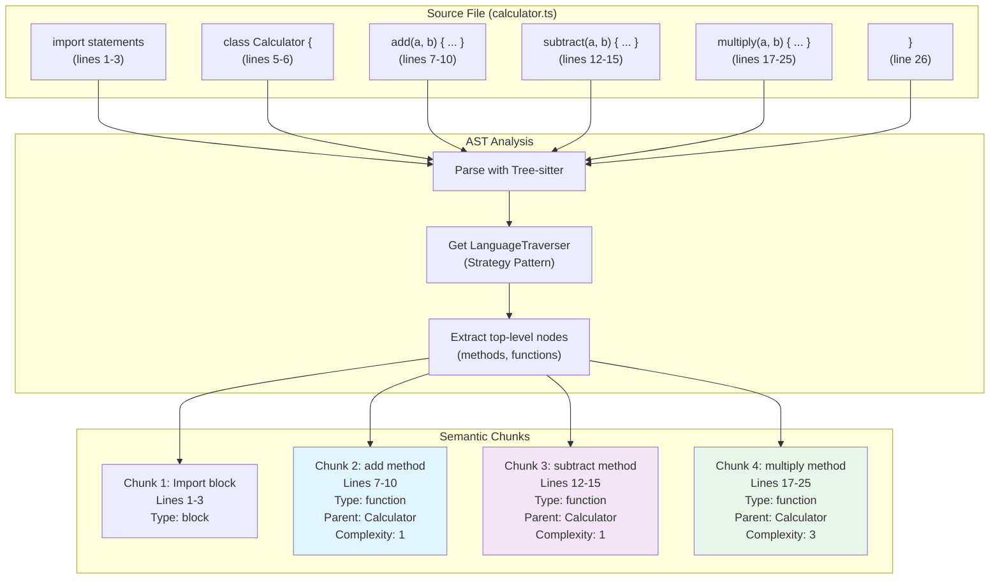
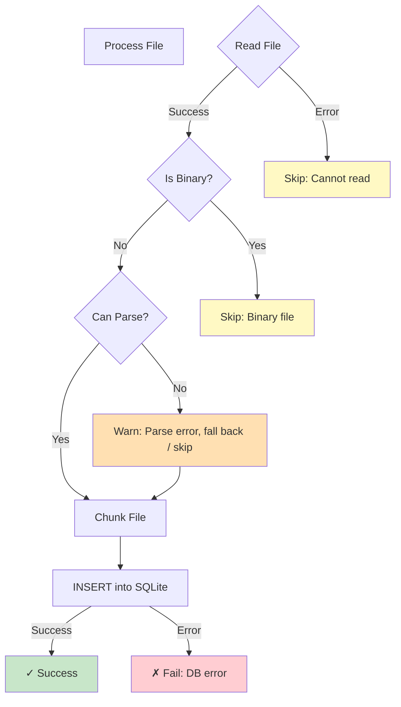

# Indexing Flow

This document details the indexing workflows for both full and incremental indexing operations.

## Full indexing flow

Full indexing is triggered by the `lien index` command and indexes the entire codebase from scratch.


```mermaid
sequenceDiagram
    actor User
    participant CLI as CLI Command
    participant Config as ConfigService
    participant Scanner as File Scanner
    participant Framework as Ecosystem Presets
    participant TestAssoc as Test Association Manager
    participant Store as SqliteBackend
    participant VersionFile as Version File

    User->>CLI: lien index
    CLI->>CLI: Show spinner

    Note over CLI,Config: Phase 1: Configuration
    CLI->>Config: load(rootDir)
    Config->>Config: Read .lien.config.json
    Config->>Config: Merge with defaults
    Config->>Config: Validate config
    Config-->>CLI: LienConfig

    Note over CLI,Scanner: Phase 2: File Discovery
    CLI->>Scanner: scanFilesToIndex()
    Scanner->>Framework: detectEcosystems()
    Framework-->>Scanner: Ecosystem list
    Scanner->>Scanner: Apply include/exclude patterns
    Scanner->>Scanner: Respect ecosystem boundaries
    Scanner->>Scanner: Filter .gitignore
    Scanner-->>CLI: File list (e.g., 1000 files)
    CLI->>CLI: Update spinner: "Found 1000 files"

    Note over CLI,TestAssoc: Phase 3: Test Associations
    CLI->>TestAssoc: buildAssociations(files)

    rect rgb(255, 243, 224)
        Note right of TestAssoc: Pass 1: Convention-Based
        loop For each file
            TestAssoc->>TestAssoc: Check file + directory patterns
            TestAssoc->>TestAssoc: Match test ↔ source
        end
    end

    rect rgb(252, 228, 236)
        Note right of TestAssoc: Pass 2: Import Analysis
        loop For each test file
            TestAssoc->>TestAssoc: Parse imports, resolve paths, link to source
        end
        TestAssoc->>TestAssoc: Merge with convention map
    end

    TestAssoc-->>CLI: Test association map
    CLI->>CLI: Update spinner: "Analyzed test associations"

    Note over CLI,Store: Phase 4: Open Store
    CLI->>Store: initialize()
    Store->>Store: Open SQLite (WAL), ensure schema + FTS triggers
    Store-->>CLI: Ready (no model to load)

    Note over CLI,Store: Phase 5: File Processing (Concurrent)
    CLI->>CLI: Start progress tracking

    par Process File 1..N (p-limit concurrency)
        CLI->>CLI: Read file content
        CLI->>CLI: Detect language
        alt Language supports AST
            CLI->>CLI: Parse with Tree-sitter, get LanguageTraverser
            CLI->>CLI: Extract semantic chunks (functions, methods)
            CLI->>CLI: Calculate complexity metrics
        else Unsupported or fallback
            CLI->>CLI: Chunk by lines (75 lines, 10 overlap)
        end
        CLI->>CLI: Extract symbols + imports/exports
        CLI->>CLI: Add test associations
        CLI->>CLI: Accumulate chunks
    end

    Note over CLI,Store: Phase 6: Storage
    loop For each batch of chunks
        CLI->>Store: insertBatch(metadatas, contents)
        Store->>Store: Serialize chunk → row, INSERT INTO chunks
        Store->>Store: Triggers sync chunks_fts (FTS5)
        Store-->>CLI: Success
        CLI->>CLI: Update progress
    end

    Note over CLI,VersionFile: Phase 7: Finalization
    CLI->>VersionFile: writeVersionFile()
    VersionFile-->>CLI: Success

    CLI->>CLI: Calculate statistics
    CLI-->>User: ✓ Indexed 1000 files (2500 chunks) in 30s
```

## Incremental indexing flow

Incremental indexing handles individual file changes without reindexing the entire codebase.


```mermaid
sequenceDiagram
    participant Source as Git/FileWatcher
    participant MCP as MCP Server
    participant Config as ConfigService
    participant Incremental as Incremental Indexer
    participant Store as SqliteBackend
    participant VersionFile as Version File
    participant Client as MCP Client (AI)

    Note over Source,MCP: Change Detection
    Source->>Source: Detect file change
    Source->>MCP: Notify: files changed
    MCP->>MCP: Debounce changes (1s)

    Note over MCP,Incremental: Background Reindex
    MCP->>Config: load(rootDir)
    Config-->>MCP: LienConfig

    loop For each changed file
        MCP->>Incremental: indexSingleFile(filepath)

        alt File exists and is valid code
            Incremental->>Incremental: Read + chunk file, extract symbols/metadata
            Note over Incremental,Store: Atomic Update
            Incremental->>Store: updateFile(filepath, metadatas, contents)
            Store->>Store: Begin transaction
            Store->>Store: DELETE old rows (WHERE file = ?)
            Store->>Store: INSERT new rows
            Store->>Store: Triggers sync chunks_fts
            Store->>Store: Commit transaction
            Store-->>Incremental: Success
            Incremental->>MCP: Log: ✓ Updated filepath
        else Binary/empty or deleted
            Incremental->>Store: deleteByFile(filepath)
            Store->>Store: DELETE WHERE file = ? (triggers clean FTS)
            Store-->>Incremental: Success
            Incremental->>MCP: Log: Removed file
        end
    end

    Note over MCP,VersionFile: Update Version
    MCP->>VersionFile: writeVersionFile()
    VersionFile-->>MCP: Success

    Note over MCP,Client: Version Check & Reconnect
    loop Every 2 seconds
        MCP->>VersionFile: Check version
        VersionFile-->>MCP: Current version
        alt Version changed
            MCP->>Store: reopen SQLite handle
            Store-->>MCP: Reconnected to updated index
        else No change
            MCP->>MCP: Continue polling
        end
    end

    Note over Client: Next Query
    Client->>MCP: search_code("new code terms")
    MCP->>Store: search(query text)
    Store-->>MCP: Results (includes newly indexed code)
    MCP-->>Client: Return results
```

## Chunking strategy

Lien uses **AST-based semantic chunking** for supported languages (TypeScript, JavaScript, Python, PHP, Rust) and falls back to line-based chunking for others.

### AST-based semantic chunking (v0.13.0+)


```mermaid
graph TD
    subgraph "Source File (calculator.ts)"
        IMPORTS["import statements<br/>(lines 1-3)"]
        CLASS["class Calculator {<br/>(lines 5-6)"]
        ADD["  add(a, b) { ... }<br/>(lines 7-10)"]
        SUB["  subtract(a, b) { ... }<br/>(lines 12-15)"]
        MUL["  multiply(a, b) { ... }<br/>(lines 17-25)"]
        CLOSE["}<br/>(line 26)"]
    end
    
    subgraph "AST Analysis"
        PARSE["Parse with Tree-sitter"]
        TRAVERSE["Get LanguageTraverser<br/>(Strategy Pattern)"]
        EXTRACT["Extract top-level nodes<br/>(methods, functions)"]
    end
    
    subgraph "Semantic Chunks"
        CHUNK1["Chunk 1: Import block<br/>Lines 1-3<br/>Type: block"]
        CHUNK2["Chunk 2: add method<br/>Lines 7-10<br/>Type: function<br/>Parent: Calculator<br/>Complexity: 1"]
        CHUNK3["Chunk 3: subtract method<br/>Lines 12-15<br/>Type: function<br/>Parent: Calculator<br/>Complexity: 1"]
        CHUNK4["Chunk 4: multiply method<br/>Lines 17-25<br/>Type: function<br/>Parent: Calculator<br/>Complexity: 3"]
    end
    
    IMPORTS --> PARSE
    CLASS --> PARSE
    ADD --> PARSE
    SUB --> PARSE
    MUL --> PARSE
    CLOSE --> PARSE
    
    PARSE --> TRAVERSE
    TRAVERSE --> EXTRACT
    EXTRACT --> CHUNK1
    EXTRACT --> CHUNK2
    EXTRACT --> CHUNK3
    EXTRACT --> CHUNK4
    
    style CHUNK2 fill:#e1f5ff
    style CHUNK3 fill:#f3e5f5
    style CHUNK4 fill:#e8f5e9
```

### Key advantages of AST chunking

**Old (line-based):**
```typescript
// Chunk 1 (lines 1-75) - Function split!
class Calculator {
  multiply(a: number, b: number): number {
    let result = 0;
    for (let i = 0; i < b; i++) {
      result += a;
    }
    
// Chunk 2 (lines 66-140) - Missing function start!
    return result;
  }
}
```

**New (AST-based):**
```typescript
// Chunk: multiply method (complete semantic unit)
multiply(a: number, b: number): number {
  let result = 0;
  for (let i = 0; i < b; i++) {
    result += a;
  }
  return result;
}

// Metadata:
{
  "symbolName": "multiply",
  "symbolType": "method",
  "parentClass": "Calculator",
  "complexity": 3,
  "parameters": ["a: number", "b: number"],
  "signature": "multiply(a: number, b: number): number"
}
```

### Language traverser (Strategy Pattern)

Each language has a dedicated traverser implementing the `LanguageTraverser` interface:

```mermaid
graph LR
    CHUNKER["Chunker<br/>(language-agnostic)"]
    REGISTRY["Language Registry"]
    TS["TypeScriptTraverser"]
    JS["JavaScriptTraverser"]
    PY["PythonTraverser"]
    PHP["PHPTraverser"]
    RS["RustTraverser"]

    CHUNKER -->|getTraverser(language)| REGISTRY
    REGISTRY -->|typescript| TS
    REGISTRY -->|javascript| JS
    REGISTRY -->|python| PY
    REGISTRY -->|php| PHP
    REGISTRY -->|rust| RS

    TS -.->|"Node types:<br/>function_declaration<br/>method_definition<br/>class_declaration"| TS
    JS -.->|"Same as TS"| JS
    PY -.->|"Node types:<br/>function_definition<br/>class_definition"| PY
    PHP -.->|"Node types:<br/>function_definition<br/>method_declaration<br/>class_declaration"| PHP
    RS -.->|"Node types:<br/>function_item<br/>impl_item<br/>trait_item"| RS
```

**Traverser responsibilities:**
- Define target node types (`function_declaration`, `class_definition`, etc.)
- Identify containers to extract children from (classes)
- Find parent context (class name for methods)
- Detect functions in declarations (arrow functions in const/let)

See [ADR-002: Strategy Pattern for AST Traversal](decisions/0002-strategy-pattern-ast-traversal.md) for details.

### Fallback to line-based chunking

AST chunking automatically falls back to line-based for:
- **Unsupported languages** (languages without a `LanguageDefinition` in the registry)
- **Very large files** (>1000 lines trigger Tree-sitter buffer limits)
- **Parse errors** (malformed syntax)

**Line-based chunking (fallback):**
- Fixed chunk size (default: 75 lines)
- Fixed overlap (default: 10 lines)
- No semantic awareness
- Still works, just less optimal

## Incremental indexing performance

Illustrative, order-of-magnitude performance for a single file change (not a re-benchmarked figure):

```
Single File Change (100 lines):
  Read & Chunk:      ~50ms
  Update SQLite:     ~10ms (delete + insert; triggers keep FTS in sync)
  Update Version:    ~10ms
  Total:             ~70ms

Note: Runs in background, doesn't block MCP server
```

## Error handling strategies

### File processing errors


```mermaid
flowchart TD
    START[Process File]
    READ{Read File}
    BINARY{Is Binary?}
    PARSE{Can Parse?}
    CHUNK[Chunk File]
    STORE[INSERT into SQLite]
    SUCCESS[✓ Success]

    READ -->|Success| BINARY
    READ -->|Error| SKIP1[Skip: Cannot read]

    BINARY -->|No| PARSE
    BINARY -->|Yes| SKIP2[Skip: Binary file]

    PARSE -->|Yes| CHUNK
    PARSE -->|No| WARN[Warn: Parse error, fall back / skip]
    WARN --> CHUNK

    CHUNK --> STORE
    STORE -->|Success| SUCCESS
    STORE -->|Error| FAIL[✗ Fail: DB error]

    style SUCCESS fill:#c8e6c9
    style FAIL fill:#ffcdd2
    style SKIP1 fill:#fff9c4
    style SKIP2 fill:#fff9c4
    style WARN fill:#ffe0b2
```

### Recovery strategies

1. **Non-critical errors** (binary files, parse errors):
   - Log warning
   - Skip the file (or fall back to line-based chunking on a parse error)
   - Continue with remaining files

2. **Critical errors** (database write failure, disk full):
   - Log error
   - Rollback transaction if in progress
   - Throw error to user
   - Abort indexing

## Concurrency and batching

File processing runs concurrently via `p-limit(concurrency)` (default 4); the parse/chunk stage is additionally capped at `PARSE_STAGE_MAX_CONCURRENCY` (4) regardless of caller-requested concurrency, see [ADR-013](decisions/0013-prebuilt-native-parser-napi-rs.md#negative--risks). Chunks are inserted in batches (`store.insertBatch(metadatas, contents)`) rather than one `INSERT` per chunk: SQLite's row-level triggers still fire once per inserted row either way, but batching groups every row into a single transaction instead of one commit per chunk, cutting per-insert write overhead.

## Index version management

### Version file structure

```json
{
  "version": 1731785400000,
  "timestamp": "2026-07-04T20:30:00.000Z",
  "config": {
    "chunkSize": 75,
    "chunkOverlap": 10
  },
  "stats": {
    "filesIndexed": 1000,
    "chunksCreated": 2500
  }
}
```

### Version check flow

```
MCP Server starts → Read version file → Store in memory
Every 2s: Check file → Compare versions → Reconnect if changed

This allows:
- `lien index` can run while MCP server is running
- Server automatically picks up changes
- No need to restart Cursor/AI assistant
```

