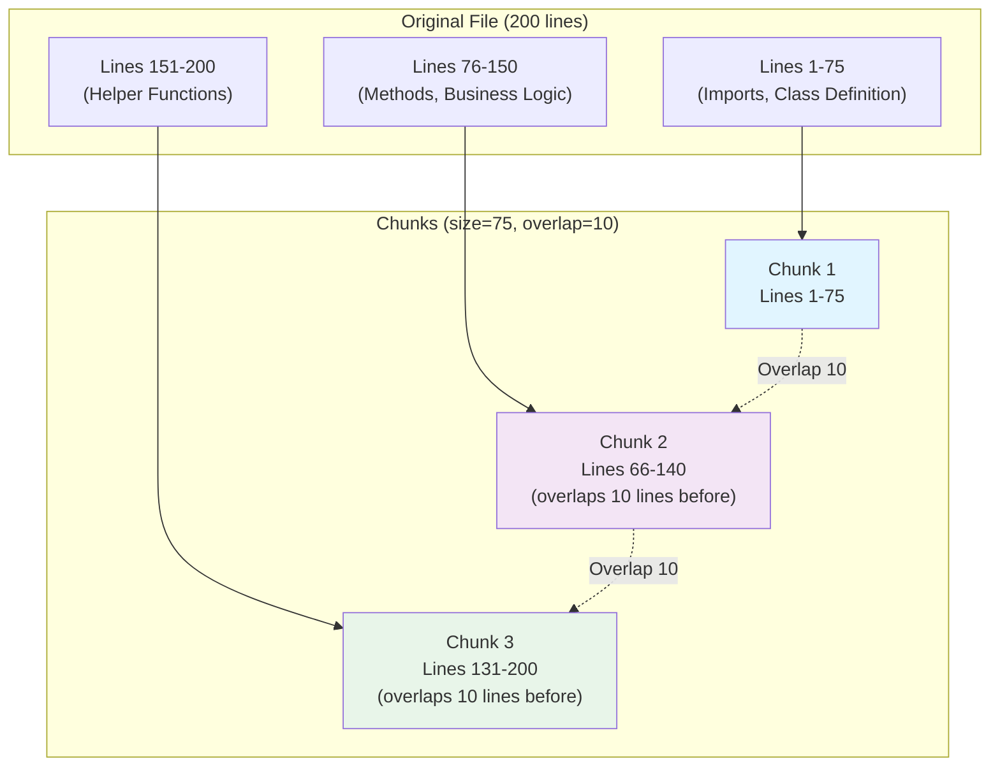

# Indexing Flow

This document details the indexing workflows for both full and incremental indexing operations.

## Full Indexing Flow

Full indexing is triggered by `lien index` command and indexes the entire codebase from scratch.

```mermaid
sequenceDiagram
    actor User
    participant CLI as CLI Command
    participant Config as ConfigService
    participant Scanner as File Scanner
    participant Framework as Framework Detector
    participant TestAssoc as Test Association Manager
    participant Embeddings as Embedding Service
    participant VectorDB as Vector Database
    participant VersionFile as Version File
    
    User->>CLI: lien index
    CLI->>CLI: Show spinner
    
    Note over CLI,Config: Phase 1: Configuration
    CLI->>Config: load(rootDir)
    Config->>Config: Read .lien.config.json
    Config->>Config: Merge with defaults
    Config->>Config: Validate config
    Config-->>CLI: LienConfig
    
    Note over CLI,Scanner: Phase 2: File Discovery
    CLI->>Scanner: scanCodebaseWithFrameworks()
    Scanner->>Framework: Get framework instances
    Framework-->>Scanner: Framework list
    Scanner->>Scanner: Apply include/exclude patterns
    Scanner->>Scanner: Respect framework boundaries
    Scanner->>Scanner: Filter .gitignore
    Scanner-->>CLI: File list (e.g., 1000 files)
    CLI->>CLI: Update spinner: "Found 1000 files"
    
    Note over CLI,TestAssoc: Phase 3: Test Associations
    CLI->>TestAssoc: buildAssociations(files)
    
    rect rgb(255, 243, 224)
        Note right of TestAssoc: Pass 1: Convention-Based
        TestAssoc->>TestAssoc: Partition by framework
        loop For each file
            TestAssoc->>TestAssoc: Check file patterns
            TestAssoc->>TestAssoc: Check directory patterns
            TestAssoc->>TestAssoc: Match test ↔ source
        end
        TestAssoc->>TestAssoc: Build association map
    end
    
    rect rgb(252, 228, 236)
        Note right of TestAssoc: Pass 2: Import Analysis
        TestAssoc->>TestAssoc: Filter Tier 1 languages
        loop For each test file
            TestAssoc->>TestAssoc: Parse import statements
            TestAssoc->>TestAssoc: Resolve file paths
            TestAssoc->>TestAssoc: Link to source files
        end
        TestAssoc->>TestAssoc: Merge with convention map
    end
    
    TestAssoc-->>CLI: Test association map
    CLI->>CLI: Update spinner: "Analyzed test associations"
    
    Note over CLI,Embeddings: Phase 4: Initialize Services
    CLI->>Embeddings: initialize()
    Embeddings->>Embeddings: Load all-MiniLM-L6-v2 model
    Embeddings->>Embeddings: Cache model in memory
    Embeddings-->>CLI: Ready
    CLI->>CLI: Update spinner: "Embedding model loaded"
    
    CLI->>VectorDB: initialize()
    VectorDB->>VectorDB: Connect to LanceDB
    VectorDB->>VectorDB: Create table if not exists
    VectorDB-->>CLI: Ready
    CLI->>CLI: Update spinner: "Vector database initialized"
    
    Note over CLI,VectorDB: Phase 5: File Processing (Concurrent)
    CLI->>CLI: Start progress tracking
    
    par Process File 1
        CLI->>CLI: Read file content
        CLI->>CLI: Detect language
        CLI->>CLI: Chunk file (75 lines, 10 overlap)
        CLI->>CLI: Extract symbols
        CLI->>CLI: Add test associations
        CLI->>CLI: Accumulate chunks
    and Process File 2
        CLI->>CLI: Read file content
        CLI->>CLI: Detect language
        CLI->>CLI: Chunk file
        CLI->>CLI: Extract symbols
        CLI->>CLI: Add test associations
        CLI->>CLI: Accumulate chunks
    and Process File 3
        CLI->>CLI: Read file content
        CLI->>CLI: Detect language
        CLI->>CLI: Chunk file
        CLI->>CLI: Extract symbols
        CLI->>CLI: Add test associations
        CLI->>CLI: Accumulate chunks
    and Process File N
        CLI->>CLI: Read file content
        CLI->>CLI: Detect language
        CLI->>CLI: Chunk file
        CLI->>CLI: Extract symbols
        CLI->>CLI: Add test associations
        CLI->>CLI: Accumulate chunks
    end
    
    Note over CLI,VectorDB: Phase 6: Batch Embedding & Storage
    loop For each batch (50 chunks)
        CLI->>Embeddings: embedBatch(texts[])
        Embeddings->>Embeddings: Tokenize texts
        Embeddings->>Embeddings: Generate embeddings
        Embeddings->>Embeddings: Normalize vectors
        Embeddings-->>CLI: Float32Array[] (384 dims each)
        
        CLI->>VectorDB: insertBatch(vectors, metadata, texts)
        VectorDB->>VectorDB: Prepare records
        VectorDB->>VectorDB: Batch insert to LanceDB
        VectorDB-->>CLI: Success
        
        CLI->>CLI: Update progress
    end
    
    Note over CLI,VersionFile: Phase 7: Finalization
    CLI->>VersionFile: writeVersionFile()
    VersionFile->>VersionFile: Generate timestamp
    VersionFile->>VersionFile: Write version.json
    VersionFile-->>CLI: Success
    
    CLI->>CLI: Calculate statistics
    CLI->>CLI: Show success message
    CLI-->>User: ✓ Indexed 1000 files (2500 chunks) in 45s
```



## Incremental Indexing Flow

Incremental indexing handles individual file changes without reindexing the entire codebase.


## Chunking Strategy

Visual representation of how files are chunked with overlap:



### Why Overlap?

Consider a function at the boundary:

```typescript
// Lines 70-80 (chunk boundary at line 75)

// Chunk 1 ends here (line 75)
export function calculateTotal(
  items: Item[]
): number {
  return items.reduce(
    // Chunk 2 starts here (line 66, includes 10-line overlap)
    (sum, item) => sum + item.price,
    0
  );
}
```

**Without overlap:** Function split across chunks → poor search results
**With overlap:** Full function in both chunks → better search results

## Performance Characteristics

### Full Indexing

Typical performance on a medium-sized project:

```
Project Size: 1,000 files, 100,000 lines of code
Configuration: 
  - concurrency: 4
  - chunkSize: 75
  - embeddingBatchSize: 50

Timeline:
  Configuration:        ~0.5s
  File Discovery:       ~2s
  Test Associations:    ~3s (Pass 1) + ~2s (Pass 2)
  Embedding Model Load: ~5s (first time only)
  Vector DB Init:       ~1s
  File Processing:      ~25s (4 concurrent workers)
  Embedding Generation: ~15s (batched)
  Storage:              ~5s
  Total:                ~58s

Chunks Created: ~2,000
Average: 17 files/second
```

### Incremental Indexing

Typical performance for file changes:

```
Single File Change (100 lines):
  Read & Chunk:      ~50ms
  Generate Embeddings: ~200ms
  Update Database:   ~100ms
  Update Version:    ~10ms
  Total:             ~360ms

10 Files Changed:
  Sequential Processing: ~3.6s
  Version Update:        ~10ms
  Total:                 ~3.61s

Note: Runs in background, doesn't block MCP server
```

## Error Handling Strategies

### File Processing Errors


### Recovery Strategies

1. **Non-critical errors** (binary files, parse errors):
   - Log warning
   - Skip file
   - Continue with remaining files

2. **Retryable errors** (embedding generation):
   - Retry once
   - If fails again, skip file
   - Continue with remaining files

3. **Critical errors** (database connection, disk full):
   - Log error
   - Rollback transaction if in progress
   - Throw error to user
   - Abort indexing

## Optimization Techniques

### 1. Concurrency Control

```typescript
// Use p-limit to control parallelism
const limit = pLimit(concurrency); // e.g., 4

const promises = files.map(file =>
  limit(async () => {
    // Process file
  })
);

await Promise.all(promises);
```

**Benefits:**
- Prevents overwhelming the system
- Balances CPU and I/O
- Configurable via `core.concurrency`

### 2. Batch Processing

```typescript
// Instead of one-by-one:
for (const chunk of chunks) {
  const vector = await embed(chunk); // ❌ Slow: N × 200ms
  await store(vector);
}

// Process in batches:
for (let i = 0; i < chunks.length; i += batchSize) {
  const batch = chunks.slice(i, i + batchSize);
  const vectors = await embedBatch(batch); // ✅ Fast: 200ms per batch
  await storeBatch(vectors);
}
```

**Benefits:**
- Reduces overhead
- Better GPU/CPU utilization
- Configurable via `core.embeddingBatchSize`

### 3. Accumulator Pattern

```typescript
// Accumulate chunks from multiple files
const accumulator = [];

for (const file of files) {
  const chunks = await processFile(file);
  accumulator.push(...chunks);
  
  // Process when batch is full
  if (accumulator.length >= batchSize) {
    await processBatch(accumulator.splice(0, batchSize));
  }
}

// Process remaining
if (accumulator.length > 0) {
  await processBatch(accumulator);
}
```

**Benefits:**
- Maximizes batch sizes
- Reduces number of API/DB calls
- More efficient resource usage

## Monitoring & Progress

### User-Visible Progress

```
Starting indexing process...
✓ Configuration loaded
✓ Found 1,000 files
✓ Analyzed test associations (250 tests → 400 sources)
✓ Embedding model loaded
✓ Vector database initialized
⏳ Processing files... [==============    ] 650/1000 (65%)
✓ Indexed 1,000 files
✓ Generated 2,500 chunks
✓ Stored embeddings (384 dimensions)
✓ Completed in 58.2s

Statistics:
  Files processed: 1,000
  Chunks created: 2,500
  Average chunk size: 40 lines
  Processing speed: 17 files/s
```

### Verbose Mode

```bash
lien index --verbose

# Additional output:
[Lien] Reading file: src/app.ts
[Lien] Detected language: typescript
[Lien] Chunked into 3 chunks
[Lien] Extracted 5 functions, 2 classes
[Lien] ✓ Indexed src/app.ts (3 chunks)
[Lien] Batch embedding: 50 chunks
[Lien] Batch insert: 50 vectors
[Lien] ⚠️ Skipping src/image.png: Binary file
[Lien] ⚠️ Skipping src/broken.ts: Parse error
```

## Index Version Management

### Version File Structure

```json
{
  "version": 1731785400000,
  "timestamp": "2025-11-16T20:30:00.000Z",
  "config": {
    "chunkSize": 75,
    "chunkOverlap": 10,
    "concurrency": 4
  },
  "stats": {
    "filesIndexed": 1000,
    "chunksCreated": 2500,
    "embeddingModel": "all-MiniLM-L6-v2"
  }
}
```

### Version Check Flow

```
MCP Server starts → Read version file → Store in memory
Every 2s: Check file → Compare versions → Reconnect if changed

This allows:
- `lien index` can run while MCP server is running
- Server automatically picks up changes
- No need to restart Cursor/AI assistant
```

