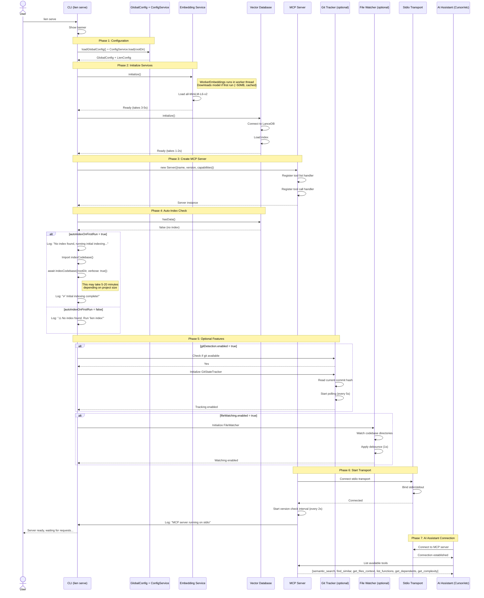
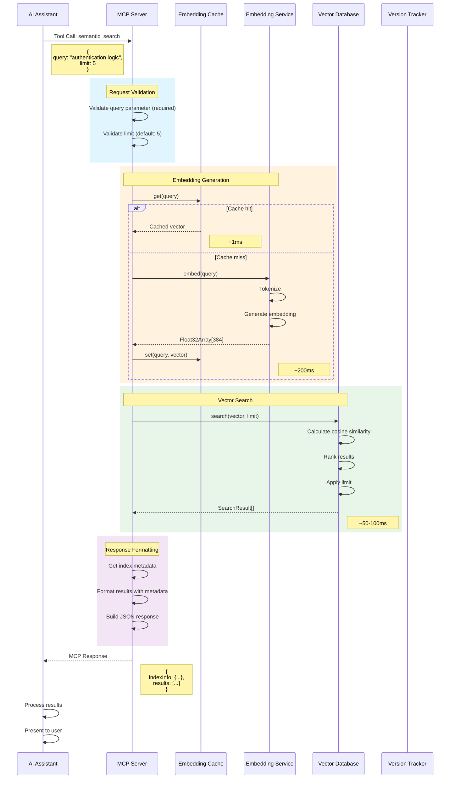
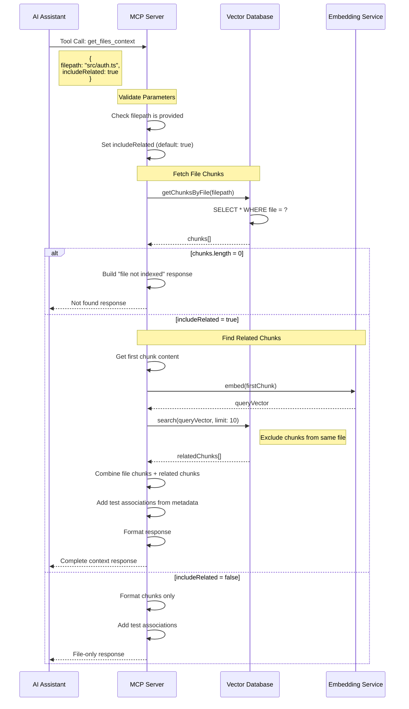
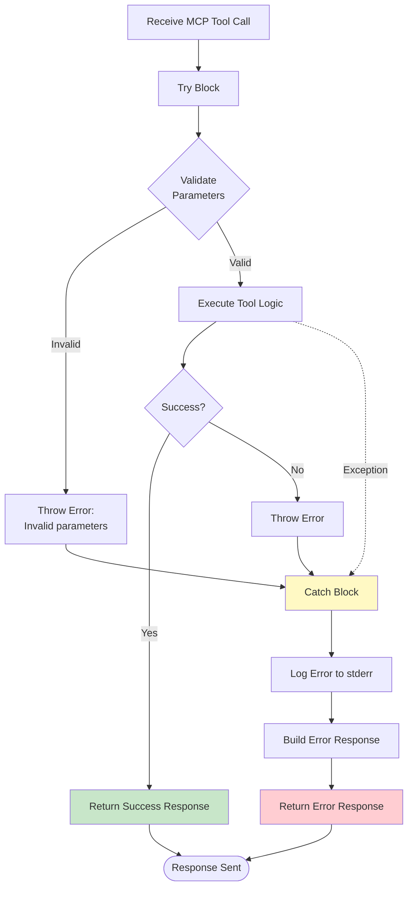
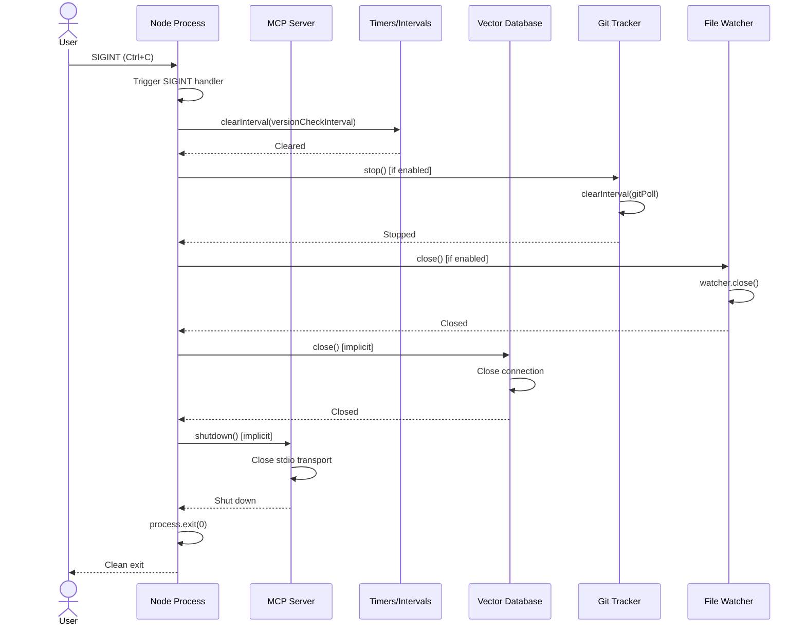

# MCP Server Flow

This document details how the MCP (Model Context Protocol) server initializes, handles requests, and manages real-time updates.

## Server Initialization



### Available MCP Tools

The server exposes six tools to AI assistants:

| Tool | Description |
|------|-------------|
| `semantic_search` | Natural language code search by meaning |
| `find_similar` | Find structurally similar code patterns |
| `get_files_context` | Get file context with dependencies and test associations (supports batch) |
| `list_functions` | Fast symbol lookup by naming pattern |
| `get_dependents` | Reverse dependency lookup for impact analysis |
| `get_complexity` | Complexity analysis (cyclomatic, cognitive, Halstead) for files or codebase |

## Tool Request Handling

### semantic_search Tool



### get_files_context Tool



## Background Update Monitoring

The MCP server monitors for index changes and automatically reconnects.

```mermaid
flowchart TB
    START([MCP Server Running])
    
    subgraph "Version Check Loop (Every 2s)"
        INTERVAL[setInterval: 2000ms]
        READ_VERSION[Read version.json]
        COMPARE{Version<br/>Changed?}
        CURRENT[Store current version]
    end
    
    subgraph "Git Detection (If Enabled)"
        GIT_POLL[Poll Git Status: 5s]
        CHECK_COMMIT[Get current commit hash]
        COMMIT_CHANGED{Commit<br/>Changed?}
        GET_CHANGED_FILES[git diff --name-only]
        FILTER_FILES[Filter by include patterns]
    end
    
    subgraph "File Watcher (If Enabled)"
        WATCH_FILES[chokidar.watch()]
        FILE_EVENT[File change event]
        DEBOUNCE[Debounce: 1000ms]
        GET_FILEPATH[Get changed file path]
    end
    
    subgraph "Incremental Reindex"
        REINDEX_START[Start background reindex]
        LOAD_CONFIG[Load config]
        INDEX_FILES[indexMultipleFiles()]
        UPDATE_VERSION[Update version.json]
        REINDEX_DONE[Log: Reindex complete]
    end
    
    subgraph "Vector DB Reconnection"
        RECONNECT_START[Trigger reconnection]
        CLOSE_CONN[Close old connection]
        REOPEN_CONN[Open new connection]
        RELOAD_INDEX[Reload vector index]
        RECONNECT_DONE[Log: Reconnected]
        NOTIFY_CLIENT[Next query uses new index]
    end
    
    START --> INTERVAL
    START --> GIT_POLL
    START --> WATCH_FILES
    
    %% Version check flow
    INTERVAL --> READ_VERSION
    READ_VERSION --> COMPARE
    COMPARE -->|No| CURRENT
    COMPARE -->|Yes| RECONNECT_START
    CURRENT --> INTERVAL
    
    %% Git detection flow
    GIT_POLL --> CHECK_COMMIT
    CHECK_COMMIT --> COMMIT_CHANGED
    COMMIT_CHANGED -->|No| GIT_POLL
    COMMIT_CHANGED -->|Yes| GET_CHANGED_FILES
    GET_CHANGED_FILES --> FILTER_FILES
    FILTER_FILES --> REINDEX_START
    
    %% File watcher flow
    WATCH_FILES --> FILE_EVENT
    FILE_EVENT --> DEBOUNCE
    DEBOUNCE --> GET_FILEPATH
    GET_FILEPATH --> REINDEX_START
    
    %% Reindex flow
    REINDEX_START --> LOAD_CONFIG
    LOAD_CONFIG --> INDEX_FILES
    INDEX_FILES --> UPDATE_VERSION
    UPDATE_VERSION --> REINDEX_DONE
    REINDEX_DONE --> INTERVAL
    
    %% Reconnect flow
    RECONNECT_START --> CLOSE_CONN
    CLOSE_CONN --> REOPEN_CONN
    REOPEN_CONN --> RELOAD_INDEX
    RELOAD_INDEX --> RECONNECT_DONE
    RECONNECT_DONE --> NOTIFY_CLIENT
    NOTIFY_CLIENT --> INTERVAL
    
    %% Styling
    classDef versionClass fill:#e1f5ff,stroke:#01579b,stroke-width:2px
    classDef gitClass fill:#e8f5e9,stroke:#1b5e20,stroke-width:2px
    classDef watchClass fill:#f3e5f5,stroke:#4a148c,stroke-width:2px
    classDef reindexClass fill:#fff3e0,stroke:#e65100,stroke-width:2px
    classDef reconnectClass fill:#fce4ec,stroke:#880e4f,stroke-width:2px
    
    class INTERVAL,READ_VERSION,COMPARE,CURRENT versionClass
    class GIT_POLL,CHECK_COMMIT,COMMIT_CHANGED,GET_CHANGED_FILES,FILTER_FILES gitClass
    class WATCH_FILES,FILE_EVENT,DEBOUNCE,GET_FILEPATH watchClass
    class REINDEX_START,LOAD_CONFIG,INDEX_FILES,UPDATE_VERSION,REINDEX_DONE reindexClass
    class RECONNECT_START,CLOSE_CONN,REOPEN_CONN,RELOAD_INDEX,RECONNECT_DONE,NOTIFY_CLIENT reconnectClass
```

## Error Handling in MCP Server



### Error Response Format

```json
{
  "content": [{
    "type": "text",
    "text": "{\"error\":\"Vector database not initialized\",\"tool\":\"semantic_search\"}"
  }],
  "isError": true
}
```

## MCP Protocol Messages

### Tool List Request

```json
{
  "jsonrpc": "2.0",
  "id": 1,
  "method": "tools/list"
}
```

**Response:**
```json
{
  "jsonrpc": "2.0",
  "id": 1,
  "result": {
    "tools": [
      {
        "name": "semantic_search",
        "description": "Search the codebase semantically...",
        "inputSchema": {
          "type": "object",
          "properties": {
            "query": {"type": "string", "description": "..."},
            "limit": {"type": "number", "default": 5}
          },
          "required": ["query"]
        }
      }
      // ... other tools
    ]
  }
}
```

### Tool Call Request

```json
{
  "jsonrpc": "2.0",
  "id": 2,
  "method": "tools/call",
  "params": {
    "name": "semantic_search",
    "arguments": {
      "query": "how do we handle authentication",
      "limit": 5
    }
  }
}
```

**Response:**
```json
{
  "jsonrpc": "2.0",
  "id": 2,
  "result": {
    "content": [{
      "type": "text",
      "text": "{\"indexInfo\":{...},\"results\":[...]}"
    }]
  }
}
```

## Performance Optimizations

### 1. Embedding Cache

```
First query: "authentication logic"
  → Generate embedding: 200ms
  → Search: 50ms
  → Total: 250ms

Same query again:
  → Get from cache: 1ms
  → Search: 50ms
  → Total: 51ms

Improvement: 5x faster
```

### 2. Lazy Initialization

```
Server Start:
  ✓ Load config: 0.5s
  ✓ Load embedding model: 3-5s
  ✓ Connect vector DB: 1-2s
  Total: 5-7s

Without lazy init (if we initialized on every query):
  ✗ Would take 5-7s per query
```

### 3. Background Reindexing

```
File changed → Trigger background reindex
  ↓
MCP server continues handling queries
  ↓
Reindex completes → Version incremented
  ↓
Next query uses updated index

User Experience: No downtime, seamless updates
```

## Logging & Debugging

### Normal Operation

```
[Lien MCP] Initializing MCP server...
[Lien MCP] Loading embedding model...
[Lien MCP] Loading vector database...
[Lien MCP] Embeddings and vector DB ready
[Lien MCP] MCP server running on stdio
```

## Shutdown & Cleanup



## Integration with AI Assistants

### Cursor Integration

```json
// In Cursor settings (.cursor/mcp.json)
{
  "mcpServers": {
    "lien": {
      "command": "lien",
      "args": ["serve"],
      "cwd": "${workspaceFolder}"
    }
  }
}
```

### Usage Flow

```
1. User opens Cursor
2. Cursor reads MCP config
3. Cursor spawns: lien serve (in project root)
4. Lien MCP server initializes
5. Cursor connects via stdio
6. User asks: "Where is the authentication logic?"
7. Cursor calls: semantic_search("authentication logic")
8. Lien returns: Relevant code chunks
9. Cursor uses results to answer user
```

### Multi-Project Support

Each workspace gets its own MCP server instance:

```
Workspace A: lien serve (PID 1234) → Uses ~/.lien/workspace-a/
Workspace B: lien serve (PID 5678) → Uses ~/.lien/workspace-b/
Workspace C: lien serve (PID 9012) → Uses ~/.lien/workspace-c/

Each server is isolated and manages its own index
```

