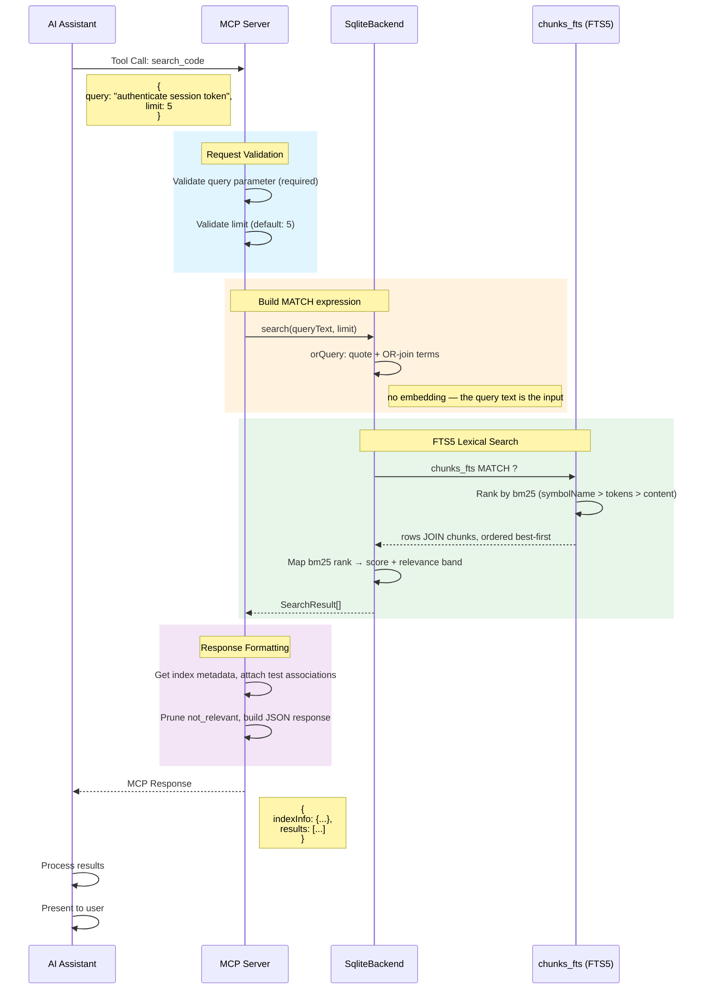
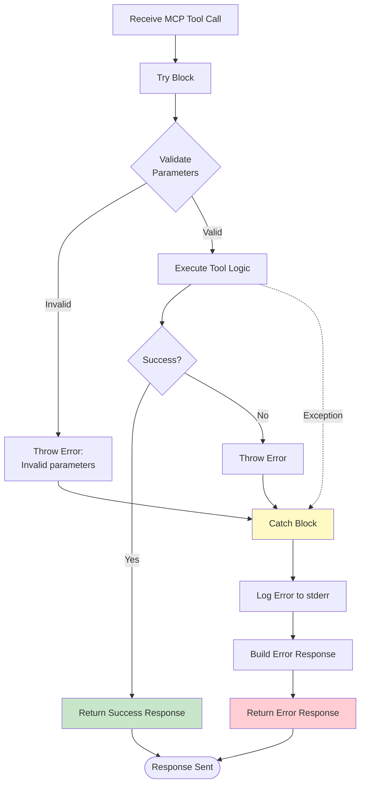
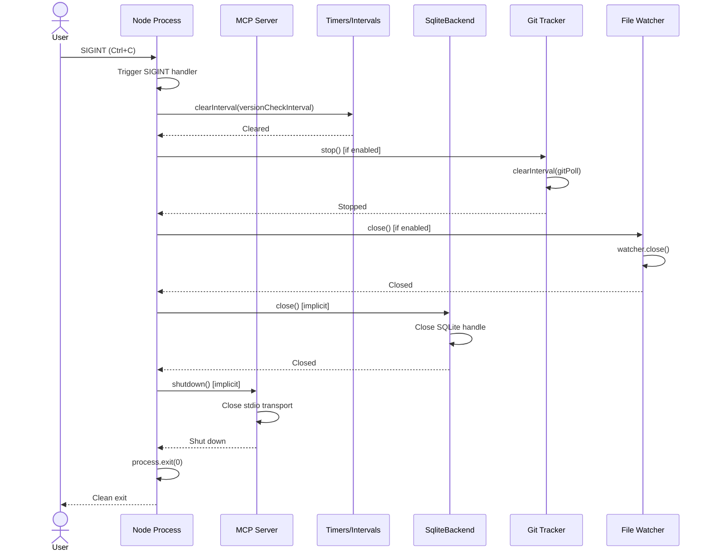

# MCP Server Flow

This document details how the MCP (Model Context Protocol) server initializes, handles requests, and manages real-time updates.

## Server initialization

```mermaid
sequenceDiagram
    actor User
    participant CLI as CLI (lien serve)
    participant Config as GlobalConfig
    participant Store as SqliteBackend
    participant MCP as MCP Server
    participant Git as Git Tracker (optional)
    participant Watcher as File Watcher (optional)
    participant Stdio as Stdio Transport
    participant AI as AI Assistant (Cursor/etc)

    User->>CLI: lien serve
    CLI->>CLI: Show banner

    Note over CLI,Config: Phase 1: Configuration
    CLI->>Config: loadGlobalConfig()
    Config-->>CLI: GlobalConfig
    Note right of Config: ConfigService/.lien.config.json is NOT loaded here —<br/>only `lien delta` reads it (complexity.thresholds)

    Note over CLI,Store: Phase 2: Open Store
    CLI->>Store: initialize()
    Store->>Store: Open SQLite (WAL), ensure schema + FTS triggers
    Note right of Store: No model to download — starts instantly
    Store-->>CLI: Ready (< 1s)

    Note over CLI,MCP: Phase 3: Create MCP Server
    CLI->>MCP: new Server({name, version, capabilities})
    MCP->>MCP: Register tool list handler
    MCP->>MCP: Register tool call handler
    MCP-->>CLI: Server instance

    Note over CLI,Store: Phase 4: Auto-Index Check
    CLI->>Store: hasData()
    Store-->>CLI: false (no index)
    
    alt not inside a git work tree (and LIEN_FORCE_INDEX unset)
        CLI->>CLI: Log: "Skipped auto-indexing: ... Set LIEN_FORCE_INDEX=1 to index anyway."
    else
        CLI->>CLI: Log: "No index found, running initial indexing..."
        CLI->>CLI: Import indexCodebase()
        CLI->>CLI: void indexCodebase({rootDir, verbose: true}) — fired without await
        Note right of CLI: Runs in the background; tools return empty<br/>results until it completes (5-20 min for large repos)
        CLI->>CLI: Log: "✅ Initial indexing complete!"
    end
    
    Note over CLI,Git: Phase 5: Optional Features (always on, no config gate)
    
    CLI->>Git: Check if git available
    Git-->>CLI: Yes
    CLI->>Git: Initialize GitStateTracker
    Git->>Git: Read current commit hash
    Git->>Git: Start polling (every 10s — DEFAULT_GIT_POLL_INTERVAL_MS)
    Git-->>CLI: Tracking enabled

    CLI->>Watcher: Initialize FileWatcher (unless --no-watch)
    Watcher->>Watcher: Watch codebase directories
    Watcher->>Watcher: Apply batching (500ms window)
    Watcher-->>CLI: Watching enabled
    
    Note over MCP,Stdio: Phase 6: Start Transport
    MCP->>Stdio: Connect stdio transport
    Stdio->>Stdio: Bind stdin/stdout
    Stdio-->>MCP: Connected
    
    MCP->>MCP: Start version check interval (every 2s)
    MCP->>CLI: Log: "MCP server running on stdio"
    CLI-->>User: Server ready, waiting for requests...
    
    Note over Stdio,AI: Phase 7: AI Assistant Connection
    AI->>Stdio: Connect to MCP server
    Stdio-->>AI: Connection established
    AI->>MCP: List available tools
    MCP-->>AI: [search_code, find_similar, get_files_context, list_functions, get_dependents, get_complexity]
```

### Available MCP tools

The server exposes six tools to AI assistants:

| Tool | Description |
|------|-------------|
| `search_code` | Full-text (FTS5/BM25) keyword code search, lexical rather than meaning-based |
| `find_similar` | Find lexically similar code (BM25 over a snippet's tokens) |
| `get_files_context` | Get file context with dependencies and test associations (supports batch) |
| `list_functions` | Fast symbol lookup by naming pattern |
| `get_dependents` | Reverse dependency lookup for impact analysis |
| `get_complexity` | Complexity analysis (cyclomatic, cognitive, Halstead) for files or codebase |

## Tool request handling

### search_code tool


```mermaid
sequenceDiagram
    participant AI as AI Assistant
    participant MCP as MCP Server
    participant Store as SqliteBackend
    participant FTS as chunks_fts (FTS5)

    AI->>MCP: Tool Call: search_code
    Note right of AI: {<br/>  query: "authenticate session token",<br/>  limit: 5<br/>}

    rect rgb(225, 245, 255)
        Note over MCP: Request Validation
        MCP->>MCP: Validate query parameter (required)
        MCP->>MCP: Validate limit (default: 5)
    end

    rect rgb(255, 243, 224)
        Note over MCP,Store: Build MATCH expression
        MCP->>Store: search(queryText, limit)
        Store->>Store: orQuery: quote + OR-join terms
        Note right of Store: no embedding — the query text is the input
    end

    rect rgb(232, 245, 233)
        Note over Store,FTS: FTS5 Lexical Search
        Store->>FTS: chunks_fts MATCH ?
        FTS->>FTS: Rank by bm25 (symbolName > tokens > content)
        FTS-->>Store: rows JOIN chunks, ordered best-first
        Store->>Store: Map bm25 rank → score + relevance band
        Store-->>MCP: SearchResult[]
    end

    rect rgb(243, 229, 245)
        Note over MCP: Response Formatting
        MCP->>MCP: Get index metadata, attach test associations
        MCP->>MCP: Prune not_relevant, build JSON response
    end

    MCP-->>AI: MCP Response
    Note right of MCP: {<br/>  indexInfo: {...},<br/>  results: [...]<br/>}

    AI->>AI: Process results
    AI->>AI: Present to user
```

### get_files_context tool

```mermaid
sequenceDiagram
    participant AI as AI Assistant
    participant MCP as MCP Server
    participant Store as SqliteBackend

    AI->>MCP: Tool Call: get_files_context
    Note right of AI: {<br/>  filepaths: "src/auth.ts",<br/>  includeRelated: true<br/>}

    Note over MCP: Validate Parameters
    MCP->>MCP: Check filepath(s) provided
    MCP->>MCP: Set includeRelated (default: true)

    Note over MCP,Store: Fetch File Chunks (hot path)
    MCP->>Store: scanWithFilter({ file })
    Store->>Store: SELECT ... WHERE file IN (?) — idx_chunks_file
    Store-->>MCP: chunks[] (sub-millisecond)

    alt chunks.length = 0
        MCP->>MCP: Build "file not indexed" response
        MCP-->>AI: Not found response
    else includeRelated = true
        Note over MCP,Store: Find Related Chunks
        MCP->>Store: search(terms from file's symbols, limit)
        Note right of Store: FTS5 keyword match; exclude same file
        Store-->>MCP: relatedChunks[]
        MCP->>MCP: Combine file chunks + related chunks
        MCP->>MCP: Add test associations from metadata
        MCP-->>AI: Complete context response
    else includeRelated = false
        MCP->>MCP: Format chunks only + test associations
        MCP-->>AI: File-only response
    end
```

## Background update monitoring

The MCP server monitors for index changes and automatically reconnects.

```mermaid
flowchart TB
    START([MCP Server Running])
    
    subgraph "Version Check Loop (Every 2s)"
        INTERVAL[setInterval: 2000ms]
        READ_VERSION[Read version.json]
        COMPARE{Version<br/>Changed?}
        CURRENT[Store current version]
    end
    
    subgraph "Git Detection (always on)"
        GIT_POLL[Poll Git Status: 10s]
        CHECK_COMMIT[Get current commit hash]
        COMMIT_CHANGED{Commit<br/>Changed?}
        GET_CHANGED_FILES[git diff --name-only]
        FILTER_FILES[Filter by include patterns]
    end
    
    subgraph "File Watcher (on by default, --no-watch to disable)"
        WATCH_FILES[chokidar.watch()]
        FILE_EVENT[File change event]
        DEBOUNCE[Batch window: 500ms]
        GET_FILEPATH[Get changed file path]
    end
    
    subgraph "Incremental Reindex"
        REINDEX_START[Start background reindex]
        INDEX_FILES[indexMultipleFiles() — no .lien.config.json load; AST chunking is hardcoded]
        UPDATE_VERSION[Update version.json]
        REINDEX_DONE[Log: Reindex complete]
    end
    
    subgraph "SQLite Handle Reopen"
        RECONNECT_START[Trigger reopen]
        CLOSE_CONN[Close old handle]
        REOPEN_CONN[Open new handle]
        RELOAD_INDEX[Read updated index]
        RECONNECT_DONE[Log: Reconnected]
        NOTIFY_CLIENT[Next query uses new index]
    end
    
    START --> INTERVAL
    START --> GIT_POLL
    START --> WATCH_FILES
    
    %% Version check flow
    INTERVAL --> READ_VERSION
    READ_VERSION --> COMPARE
    COMPARE -->|No| CURRENT
    COMPARE -->|Yes| RECONNECT_START
    CURRENT --> INTERVAL
    
    %% Git detection flow
    GIT_POLL --> CHECK_COMMIT
    CHECK_COMMIT --> COMMIT_CHANGED
    COMMIT_CHANGED -->|No| GIT_POLL
    COMMIT_CHANGED -->|Yes| GET_CHANGED_FILES
    GET_CHANGED_FILES --> FILTER_FILES
    FILTER_FILES --> REINDEX_START
    
    %% File watcher flow
    WATCH_FILES --> FILE_EVENT
    FILE_EVENT --> DEBOUNCE
    DEBOUNCE --> GET_FILEPATH
    GET_FILEPATH --> REINDEX_START
    
    %% Reindex flow
    REINDEX_START --> INDEX_FILES
    INDEX_FILES --> UPDATE_VERSION
    UPDATE_VERSION --> REINDEX_DONE
    REINDEX_DONE --> INTERVAL
    
    %% Reconnect flow
    RECONNECT_START --> CLOSE_CONN
    CLOSE_CONN --> REOPEN_CONN
    REOPEN_CONN --> RELOAD_INDEX
    RELOAD_INDEX --> RECONNECT_DONE
    RECONNECT_DONE --> NOTIFY_CLIENT
    NOTIFY_CLIENT --> INTERVAL
    
    %% Styling
    classDef versionClass fill:#e1f5ff,stroke:#01579b,stroke-width:2px
    classDef gitClass fill:#e8f5e9,stroke:#1b5e20,stroke-width:2px
    classDef watchClass fill:#f3e5f5,stroke:#4a148c,stroke-width:2px
    classDef reindexClass fill:#fff3e0,stroke:#e65100,stroke-width:2px
    classDef reconnectClass fill:#fce4ec,stroke:#880e4f,stroke-width:2px
    
    class INTERVAL,READ_VERSION,COMPARE,CURRENT versionClass
    class GIT_POLL,CHECK_COMMIT,COMMIT_CHANGED,GET_CHANGED_FILES,FILTER_FILES gitClass
    class WATCH_FILES,FILE_EVENT,DEBOUNCE,GET_FILEPATH watchClass
    class REINDEX_START,INDEX_FILES,UPDATE_VERSION,REINDEX_DONE reindexClass
    class RECONNECT_START,CLOSE_CONN,REOPEN_CONN,RELOAD_INDEX,RECONNECT_DONE,NOTIFY_CLIENT reconnectClass
```

## Error handling in MCP server


```mermaid
flowchart TD
    REQUEST[Receive MCP Tool Call]
    TRY[Try Block]
    VALIDATE{Validate<br/>Parameters}
    EXECUTE[Execute Tool Logic]
    SUCCESS{Success?}
    RETURN_SUCCESS[Return Success Response]
    
    CATCH[Catch Block]
    LOG_ERROR[Log Error to stderr]
    BUILD_ERROR[Build Error Response]
    RETURN_ERROR[Return Error Response]
    
    REQUEST --> TRY
    TRY --> VALIDATE
    
    VALIDATE -->|Invalid| THROW1[Throw Error:<br/>Invalid parameters]
    VALIDATE -->|Valid| EXECUTE
    
    EXECUTE --> SUCCESS
    SUCCESS -->|Yes| RETURN_SUCCESS
    SUCCESS -->|No| THROW2[Throw Error]
    
    THROW1 --> CATCH
    THROW2 --> CATCH
    EXECUTE -.->|Exception| CATCH
    
    CATCH --> LOG_ERROR
    LOG_ERROR --> BUILD_ERROR
    BUILD_ERROR --> RETURN_ERROR
    
    RETURN_SUCCESS --> END([Response Sent])
    RETURN_ERROR --> END
    
    style RETURN_SUCCESS fill:#c8e6c9
    style RETURN_ERROR fill:#ffcdd2
    style CATCH fill:#fff9c4
```

### Error response format

```json
{
  "content": [{
    "type": "text",
    "text": "{\"error\":\"Index not initialized\",\"tool\":\"search_code\"}"
  }],
  "isError": true
}
```

## Performance optimizations

### 1. Indexed lookups

```
get_files_context("src/auth.ts")
  → SELECT ... WHERE file IN (?) via idx_chunks_file
  → sub-millisecond

FTS5 keyword search
  → chunks_fts MATCH ?, ORDER BY bm25
  → single-digit milliseconds on typical indexes
```

### 2. Fast startup

```
Server Start:
  ✓ Load config: 0.5s
  ✓ Open SQLite store: < 1s   (no model to download or load)
  Total: ~1s
```

### 3. Background reindexing

```
File changed → Trigger background reindex
  ↓
MCP server continues handling queries
  ↓
Reindex completes → Version incremented
  ↓
Next query uses updated index

User Experience: No downtime, seamless updates
```

## Logging & debugging

### Normal operation

```
[Lien MCP] Initializing MCP server...
[Lien MCP] Opening SQLite store...
[Lien MCP] Index ready
[Lien MCP] MCP server running on stdio
```

## Shutdown & cleanup


```mermaid
sequenceDiagram
    actor User
    participant Process as Node Process
    participant MCP as MCP Server
    participant Intervals as Timers/Intervals
    participant Store as SqliteBackend
    participant Git as Git Tracker
    participant Watcher as File Watcher
    
    User->>Process: SIGINT (Ctrl+C)
    Process->>Process: Trigger SIGINT handler
    
    Process->>Intervals: clearInterval(versionCheckInterval)
    Intervals-->>Process: Cleared
    
    Process->>Git: stop() [if enabled]
    Git->>Git: clearInterval(gitPoll)
    Git-->>Process: Stopped
    
    Process->>Watcher: close() [if enabled]
    Watcher->>Watcher: watcher.close()
    Watcher-->>Process: Closed
    
    Process->>Store: close() [implicit]
    Store->>Store: Close SQLite handle
    Store-->>Process: Closed
    
    Process->>MCP: shutdown() [implicit]
    MCP->>MCP: Close stdio transport
    MCP-->>Process: Shut down
    
    Process->>Process: process.exit(0)
    Process-->>User: Clean exit
```

For MCP client configuration (Cursor, Claude Code, etc.) and multi-project setup, see [getting-started](../../packages/site/docs/guide/getting-started.md) and [cli-commands](../../packages/site/docs/guide/cli-commands.md).

