# System Overview

This document provides a high-level overview of Lien's architecture, showing the main components and their relationships.

## Component Architecture

```mermaid
graph TB
    subgraph "CLI Layer"
        CLI[CLI Commands]
        INIT[lien init]
        INDEX[lien index]
        SERVE[lien serve]
        STATUS[lien status]
        CONFIGCMD[lien config]
        COMPLX[lien complexity]
    end

    subgraph "MCP Server Layer"
        MCP[MCP Server]
        TOOLS[MCP Tools]
        SEMANTIC[semantic_search]
        SIMILAR[find_similar]
        CONTEXT[get_files_context]
        LIST[list_functions]
        DEPENDENTS[get_dependents]
        COMPLEXITY[get_complexity]
    end

    subgraph "Core Services"
        CONFIG[ConfigService]
        GLOBALCONFIG[GlobalConfig]
        INDEXER[Indexer]
        SCANNER[File Scanner]
        CHUNKER[Code Chunker]
        AST[AST Parser]
        TRAVERSER[Language Traversers]
        SYMBOLS[Symbol Extractor]
        TESTASSOC[Test Association Manager]
        MANIFEST[Manifest Manager]
        COMPLEXANALYZER[Complexity Analyzer]
    end

    subgraph "Data Layer"
        EMBEDDINGS[Embeddings Service]
        VECTORDB[VectorDB Factory]
        QUERY[Query Operations]
        BATCHINS[Batch Insert]
        MAINT[Maintenance Ops]
        CACHE[Embedding Cache]
    end

    subgraph "Optional Services"
        GIT[Git State Tracker]
        WATCHER[File Watcher]
        ECOSYSTEM[Ecosystem Presets]
    end

    subgraph "External Dependencies"
        TRANSFORMERS[transformers.js]
        LANCEDB[LanceDB]
        QDRANT[Qdrant]
        GITCMD[Git CLI]
    end

    %% CLI to Core
    CLI --> CONFIG
    INIT --> CONFIG
    INIT --> ECOSYSTEM
    INDEX --> INDEXER
    SERVE --> MCP
    STATUS --> CONFIG
    STATUS --> VECTORDB
    CONFIGCMD --> GLOBALCONFIG
    COMPLX --> COMPLEXANALYZER

    %% MCP to Core
    MCP --> TOOLS
    TOOLS --> SEMANTIC
    TOOLS --> SIMILAR
    TOOLS --> CONTEXT
    TOOLS --> LIST
    TOOLS --> DEPENDENTS
    TOOLS --> COMPLEXITY
    SEMANTIC --> EMBEDDINGS
    SEMANTIC --> VECTORDB
    SIMILAR --> EMBEDDINGS
    SIMILAR --> VECTORDB
    CONTEXT --> VECTORDB
    LIST --> VECTORDB
    DEPENDENTS --> VECTORDB
    COMPLEXITY --> VECTORDB

    %% Core Services Relationships
    INDEXER --> CONFIG
    INDEXER --> SCANNER
    INDEXER --> CHUNKER
    INDEXER --> SYMBOLS
    INDEXER --> TESTASSOC
    INDEXER --> EMBEDDINGS
    INDEXER --> VECTORDB
    INDEXER --> MANIFEST
    INDEXER --> COMPLEXANALYZER
    SCANNER --> ECOSYSTEM
    CHUNKER --> AST
    AST --> TRAVERSER

    %% Data Layer
    EMBEDDINGS --> CACHE
    EMBEDDINGS --> TRANSFORMERS
    VECTORDB --> QUERY
    VECTORDB --> BATCHINS
    VECTORDB --> MAINT
    QUERY --> LANCEDB
    QUERY --> QDRANT
    BATCHINS --> LANCEDB
    BATCHINS --> QDRANT
    MAINT --> LANCEDB
    MAINT --> QDRANT

    %% Optional Services
    MCP --> GIT
    MCP --> WATCHER
    GIT --> GITCMD
    WATCHER --> INDEXER

    %% Styling
    classDef cliClass fill:#e1f5ff,stroke:#01579b,stroke-width:2px
    classDef mcpClass fill:#f3e5f5,stroke:#4a148c,stroke-width:2px
    classDef coreClass fill:#e8f5e9,stroke:#1b5e20,stroke-width:2px
    classDef dataClass fill:#fff3e0,stroke:#e65100,stroke-width:2px
    classDef optionalClass fill:#fce4ec,stroke:#880e4f,stroke-width:2px
    classDef externalClass fill:#f5f5f5,stroke:#424242,stroke-width:2px

    class CLI,INIT,INDEX,SERVE,STATUS,CONFIGCMD,COMPLX cliClass
    class MCP,TOOLS,SEMANTIC,SIMILAR,CONTEXT,LIST,DEPENDENTS,COMPLEXITY mcpClass
    class CONFIG,GLOBALCONFIG,INDEXER,SCANNER,CHUNKER,AST,TRAVERSER,SYMBOLS,TESTASSOC,MANIFEST,COMPLEXANALYZER coreClass
    class EMBEDDINGS,VECTORDB,QUERY,BATCHINS,MAINT,CACHE dataClass
    class GIT,WATCHER,ECOSYSTEM optionalClass
    class TRANSFORMERS,LANCEDB,QDRANT,GITCMD externalClass
```



## Component Descriptions

### CLI Layer
- **CLI Commands**: Entry points for user interaction via command line
- **lien init**: Initializes configuration and detects ecosystem presets
- **lien index**: Indexes the codebase into the vector database
- **lien serve**: Starts the MCP server for AI assistant integration
- **lien status**: Shows current index status and configuration
- **lien config**: Manages global configuration (`set`, `get`, `list`)
- **lien complexity**: Runs complexity analysis on the codebase

### MCP Server Layer
- **MCP Server**: Implements Model Context Protocol for AI assistant communication
- **MCP Tools**: Six tools exposed to AI assistants
  - `semantic_search`: Natural language code search
  - `find_similar`: Find structurally similar code patterns
  - `get_files_context`: Get file context with dependencies and test associations (supports batch)
  - `list_functions`: Fast symbol lookup by naming pattern
  - `get_dependents`: Reverse dependency lookup for impact analysis
  - `get_complexity`: Complexity analysis for files or the entire codebase

### Core Services
- **ConfigService**: Manages per-project configuration loading, saving, and validation
- **GlobalConfig**: Manages global settings (`~/.lien/config.json`) — backend choice and Qdrant connection
- **Indexer**: Orchestrates the indexing workflow
- **File Scanner**: Scans codebase respecting .gitignore and ecosystem preset boundaries
- **Code Chunker**: Splits files using AST-based semantic chunking or line-based fallback
- **AST Parser**: Parses code into Abstract Syntax Trees using Tree-sitter
- **Language Registry**: Central registry of per-language definitions (grammar, traverser, extractor, complexity data)
- **Language Traversers**: Language-specific logic for traversing AST nodes (Strategy Pattern)
- **Symbol Extractor**: Extracts functions, classes, and interfaces from code
- **Test Association Manager**: Links test files to source files via convention and import analysis
- **Manifest Manager**: Tracks indexed file metadata for incremental updates
- **Complexity Analyzer**: Computes cyclomatic, cognitive, and Halstead complexity metrics per function

### Data Layer
- **Embeddings Service**: Generates semantic embeddings from code
- **Embedding Cache**: LRU cache for frequently searched queries
- **Vector Database**: Main VectorDB class orchestrating operations
  - **Query Operations**: Semantic search, filtering, and symbol queries
  - **Batch Insert**: Batch vector insertion with retry logic
  - **Maintenance Ops**: CRUD operations (clear, delete, update)

### Optional Services
- **Git State Tracker**: Monitors repository changes for incremental indexing
- **File Watcher**: Real-time file change detection (opt-in)
- **Ecosystem Presets**: Auto-detects project type (Node.js, PHP/Laravel, Python, Rust) and applies include/exclude patterns (replaces former Framework Detector — see [ADR-007](decisions/0007-replace-framework-detection-with-ecosystem-presets.md))

### External Dependencies
- **transformers.js**: Local embedding generation (all-MiniLM-L6-v2 model, runs in worker thread — see [ADR-008](decisions/0008-keep-transformers-js-worker-embeddings.md))
- **LanceDB**: Default vector database for semantic search (local, zero-config)
- **Qdrant**: Optional vector database backend for cross-repo search and team use
- **Git CLI**: For repository state tracking

## Data Flow

The system follows a clear data flow pattern:

1. **Configuration** → Read by all services for settings (per-project via ConfigService, global via GlobalConfig)
2. **Files** → Scanner → Chunker → Complexity Metrics → Embeddings → Vector DB
3. **Query** → Embeddings → Vector DB → Search Results
4. **Git Changes** → Git Tracker → Incremental Indexer → Vector DB

## Design Principles

### Single Responsibility
Each component has one clear purpose. For example:
- Scanner only finds files
- Chunker only splits content
- Embeddings only generates vectors

### Dependency Injection
Services accept dependencies as parameters, making testing easy:
```typescript
await indexCodebase({ 
  vectorDB,      // Injected
  embeddings,    // Injected
  config         // Injected
});
```

### Layered Architecture
- **CLI/MCP Layer**: User/AI interface
- **Core Layer**: Business logic
- **Data Layer**: Storage and retrieval
- **External Layer**: Third-party services

### Optional Features
Non-essential features (git tracking, file watching) are optional and can be disabled in configuration without affecting core functionality.

## Technology Stack

- **Language**: TypeScript (ESM)
- **CLI**: Commander.js
- **MCP**: @modelcontextprotocol/sdk
- **Vector DB**: LanceDB (default, local) or Qdrant (optional, for cross-repo search)
- **Embeddings**: @huggingface/transformers v4 (all-MiniLM-L6-v2, worker thread)
- **Testing**: Vitest
- **Build**: tsup

## Performance Characteristics

- **Concurrency**: Configurable parallel file processing (default: 4)
- **Batch Processing**: Embeddings processed in batches (default: 50)
- **Caching**: LRU cache for embedding queries
- **Lazy Loading**: Embedding model loads on first use
- **Incremental Updates**: Only modified files are reindexed

## Scaling Considerations

### Current Limits
- Single machine, single process
- Embeddings generated locally (no API calls)
- Vector database stored on local disk (LanceDB) or remote (Qdrant)

### Current Scaling Options
- **Multi-repo search**: Supported via Qdrant backend with `crossRepo=true` on search tools
- **VectorDB factory pattern**: Switch between LanceDB (local) and Qdrant (remote) via `lien config set backend qdrant`

### Future Scaling Options
- Multiple embedding models
- Cloud sync (optional)
- Team collaboration features

## Recent Architectural Improvements

### Ecosystem Presets (Replaced Framework Detection)
- **Replaced**: Rigid per-framework detection with lightweight ecosystem presets
- **Benefit**: Zero-config auto-detection of project type; simpler codebase without framework-specific code
- **Details**: See [ADR-007](decisions/0007-replace-framework-detection-with-ecosystem-presets.md)

### Embedding Backend Simplification
- **Decision**: Keep transformers.js WorkerEmbeddings as sole embedding backend
- **Removed**: Unused `embeddings.device` config option (cpu/gpu)
- **Benefit**: Simpler config, worker thread isolation, no external API dependencies
- **Details**: See [ADR-008](decisions/0008-keep-transformers-js-worker-embeddings.md)

### Consolidated Language Files with Import Extractors
- **Added**: Import extractors alongside export extractors in per-language files
- **Benefit**: Enables dependency analysis (`get_dependents`) and re-export resolution
- **Details**: See [ADR-006](decisions/0006-consolidated-language-files-with-import-extractors.md)

### AST-Based Semantic Chunking
- **Replaced**: Line-based chunking with fixed overlap
- **With**: Tree-sitter AST parsing for semantic boundaries
- **Benefit**: Functions never split, 30-35% better search quality
- **Details**: See [ADR-003](decisions/0003-ast-based-chunking.md)

### Language-Agnostic Traversal (Strategy Pattern)
- **Extracted**: Language-specific AST logic into traverser classes
- **Benefit**: Adding new languages (Python, Go, Rust) now takes 2-3 hours instead of 2 days
- **Details**: See [ADR-002](decisions/0002-strategy-pattern-ast-traversal.md)

### Per-Language Definition Pattern
- **Consolidated**: Scattered language data (12-16 files) into single self-contained per-language files
- **Result**: Each language is one file in `languages/` containing traverser, extractors, and definition. Existing modules consume from a central registry.
- **Benefit**: Adding a new AST language requires 2 files (definition + registry entry) instead of 12-16
- **Details**: See [ADR-005](decisions/0005-per-language-definition-pattern.md)

### VectorDB Module Split
- **Split**: Monolithic 1,119-line `lancedb.ts` into focused modules
- **Result**: `query.ts` (571L), `batch-insert.ts` (161L), `maintenance.ts` (89L), `lancedb.ts` (267L orchestrator)
- **Benefit**: Better testability, single responsibility, no AST parsing errors
- **Details**: See [ADR-001](decisions/0001-split-vectordb-module.md)

### Test Association Detection
- **Added**: Automatic detection of test-source relationships
- **Method**: Hybrid convention-based + import analysis
- **Accuracy**: 95% for 12+ test frameworks across 7+ languages
- **Details**: See [ADR-004](decisions/0004-test-association-detection.md)

## Architectural Decision Records

All major architectural decisions are documented in [docs/architecture/decisions/](decisions/):
- [ADR-001: Split VectorDB Module](decisions/0001-split-vectordb-module.md)
- [ADR-002: Strategy Pattern for AST Traversal](decisions/0002-strategy-pattern-ast-traversal.md)
- [ADR-003: AST-Based Semantic Chunking](decisions/0003-ast-based-chunking.md)
- [ADR-004: Test Association Detection](decisions/0004-test-association-detection.md)
- [ADR-005: Per-Language Definition Pattern](decisions/0005-per-language-definition-pattern.md)
- [ADR-006: Consolidated Language Files with Import Extractors](decisions/0006-consolidated-language-files-with-import-extractors.md)
- [ADR-007: Replace Framework Detection with Ecosystem Presets](decisions/0007-replace-framework-detection-with-ecosystem-presets.md)
- [ADR-008: Keep transformers.js WorkerEmbeddings as Sole Embedding Backend](decisions/0008-keep-transformers-js-worker-embeddings.md)

