# System Overview

This document provides a high-level overview of Lien's architecture, showing the main components and their relationships.

## Component Architecture

```mermaid
graph TB
    subgraph "CLI Layer"
        CLI[CLI Commands]
        INIT[lien init]
        INDEX[lien index]
        SERVE[lien serve]
        STATUS[lien status]
    end
    
    subgraph "MCP Server Layer"
        MCP[MCP Server]
        TOOLS[MCP Tools]
        SEMANTIC[semantic_search]
        SIMILAR[find_similar]
        CONTEXT[get_file_context]
        LIST[list_functions]
    end
    
    subgraph "Core Services"
        CONFIG[ConfigService]
        INDEXER[Indexer]
        SCANNER[File Scanner]
        CHUNKER[Code Chunker]
        SYMBOLS[Symbol Extractor]
        TESTASSOC[Test Association Manager]
    end
    
    subgraph "Data Layer"
        EMBEDDINGS[Embeddings Service]
        VECTORDB[Vector Database]
        CACHE[Embedding Cache]
    end
    
    subgraph "Optional Services"
        GIT[Git State Tracker]
        WATCHER[File Watcher]
        FRAMEWORK[Framework Detector]
    end
    
    subgraph "External Dependencies"
        TRANSFORMERS[transformers.js]
        LANCEDB[LanceDB]
        GITCMD[Git CLI]
    end
    
    %% CLI to Core
    CLI --> CONFIG
    INIT --> CONFIG
    INIT --> FRAMEWORK
    INDEX --> INDEXER
    SERVE --> MCP
    STATUS --> CONFIG
    STATUS --> VECTORDB
    
    %% MCP to Core
    MCP --> TOOLS
    TOOLS --> SEMANTIC
    TOOLS --> SIMILAR
    TOOLS --> CONTEXT
    TOOLS --> LIST
    SEMANTIC --> EMBEDDINGS
    SEMANTIC --> VECTORDB
    SIMILAR --> EMBEDDINGS
    SIMILAR --> VECTORDB
    CONTEXT --> VECTORDB
    LIST --> VECTORDB
    
    %% Core Services Relationships
    INDEXER --> CONFIG
    INDEXER --> SCANNER
    INDEXER --> CHUNKER
    INDEXER --> SYMBOLS
    INDEXER --> TESTASSOC
    INDEXER --> EMBEDDINGS
    INDEXER --> VECTORDB
    SCANNER --> FRAMEWORK
    
    %% Data Layer
    EMBEDDINGS --> CACHE
    EMBEDDINGS --> TRANSFORMERS
    VECTORDB --> LANCEDB
    
    %% Optional Services
    MCP --> GIT
    MCP --> WATCHER
    GIT --> GITCMD
    WATCHER --> INDEXER
    
    %% Styling
    classDef cliClass fill:#e1f5ff,stroke:#01579b,stroke-width:2px
    classDef mcpClass fill:#f3e5f5,stroke:#4a148c,stroke-width:2px
    classDef coreClass fill:#e8f5e9,stroke:#1b5e20,stroke-width:2px
    classDef dataClass fill:#fff3e0,stroke:#e65100,stroke-width:2px
    classDef optionalClass fill:#fce4ec,stroke:#880e4f,stroke-width:2px
    classDef externalClass fill:#f5f5f5,stroke:#424242,stroke-width:2px
    
    class CLI,INIT,INDEX,SERVE,STATUS cliClass
    class MCP,TOOLS,SEMANTIC,SIMILAR,CONTEXT,LIST mcpClass
    class CONFIG,INDEXER,SCANNER,CHUNKER,SYMBOLS,TESTASSOC coreClass
    class EMBEDDINGS,VECTORDB,CACHE dataClass
    class GIT,WATCHER,FRAMEWORK optionalClass
    class TRANSFORMERS,LANCEDB,GITCMD externalClass
```



## Component Descriptions

### CLI Layer
- **CLI Commands**: Entry points for user interaction via command line
- **lien init**: Initializes configuration and detects frameworks
- **lien index**: Indexes the codebase into the vector database
- **lien serve**: Starts the MCP server for AI assistant integration
- **lien status**: Shows current index status and configuration

### MCP Server Layer
- **MCP Server**: Implements Model Context Protocol for AI assistant communication
- **MCP Tools**: Four semantic search tools exposed to AI assistants
  - `semantic_search`: Natural language code search
  - `find_similar`: Find similar code patterns
  - `get_file_context`: Get full file context with test associations
  - `list_functions`: List functions/classes by pattern

### Core Services
- **ConfigService**: Manages configuration loading, saving, validation, and migration
- **Indexer**: Orchestrates the indexing workflow
- **File Scanner**: Scans codebase respecting .gitignore and framework boundaries
- **Code Chunker**: Splits files into overlapping chunks for better context
- **Symbol Extractor**: Extracts functions, classes, and interfaces from code
- **Test Association Manager**: Links test files to source files via two-pass detection

### Data Layer
- **Embeddings Service**: Generates semantic embeddings from code
- **Embedding Cache**: LRU cache for frequently searched queries
- **Vector Database**: Stores and searches code chunks with LanceDB

### Optional Services
- **Git State Tracker**: Monitors repository changes for incremental indexing
- **File Watcher**: Real-time file change detection (opt-in)
- **Framework Detector**: Identifies Node.js, Laravel, and other frameworks

### External Dependencies
- **transformers.js**: Local embedding generation (all-MiniLM-L6-v2 model)
- **LanceDB**: Vector database for semantic search
- **Git CLI**: For repository state tracking

## Data Flow

The system follows a clear data flow pattern:

1. **Configuration** → Read by all services for settings
2. **Files** → Scanner → Chunker → Embeddings → Vector DB
3. **Query** → Embeddings → Vector DB → Search Results
4. **Git Changes** → Git Tracker → Incremental Indexer → Vector DB

## Design Principles

### Single Responsibility
Each component has one clear purpose. For example:
- Scanner only finds files
- Chunker only splits content
- Embeddings only generates vectors

### Dependency Injection
Services accept dependencies as parameters, making testing easy:
```typescript
await indexCodebase({ 
  vectorDB,      // Injected
  embeddings,    // Injected
  config         // Injected
});
```

### Layered Architecture
- **CLI/MCP Layer**: User/AI interface
- **Core Layer**: Business logic
- **Data Layer**: Storage and retrieval
- **External Layer**: Third-party services

### Optional Features
Non-essential features (git tracking, file watching) are optional and can be disabled in configuration without affecting core functionality.

## Technology Stack

- **Language**: TypeScript (ESM)
- **CLI**: Commander.js
- **MCP**: @modelcontextprotocol/sdk
- **Vector DB**: LanceDB (vectordb package)
- **Embeddings**: transformers.js (all-MiniLM-L6-v2)
- **Testing**: Vitest
- **Build**: tsup

## Performance Characteristics

- **Concurrency**: Configurable parallel file processing (default: 4)
- **Batch Processing**: Embeddings processed in batches (default: 50)
- **Caching**: LRU cache for embedding queries
- **Lazy Loading**: Embedding model loads on first use
- **Incremental Updates**: Only modified files are reindexed

## Scaling Considerations

### Current Limits
- Single machine, single process
- Embeddings generated locally (no API calls)
- Vector database stored on local disk

### Future Scaling Options
- Multiple embedding models
- Cloud sync (optional)
- Multi-repo support
- Team collaboration features

