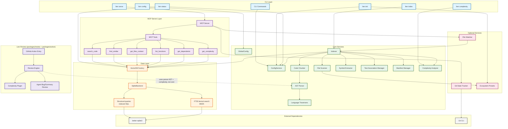

# System Overview

This document provides a high-level overview of Lien's architecture, showing the main components and their relationships.

Lien is a **code-intelligence layer** for AI agents. Its storage is a local SQLite
database: structural queries (dependents, complexity, file context, symbol lookup)
are served with indexed SQL, and discovery is served with SQLite FTS5/BM25 lexical
search. There are no embeddings and no vector database (see
[ADR-011](decisions/0011-sqlite-structural-store-fts5-lexical-search.md)).

## Component architecture


```mermaid
graph TB
    subgraph "CLI Layer"
        CLI[CLI Commands]
        INIT[lien init]
        INDEX[lien index]
        SERVE[lien serve]
        STATUS[lien status]
        CONFIGCMD[lien config]
        COMPLX[lien complexity]
    end

    subgraph "MCP Server Layer"
        MCP[MCP Server]
        TOOLS[MCP Tools]
        SEARCH[search_code]
        SIMILAR[find_similar]
        CONTEXT[get_files_context]
        LIST[list_functions]
        DEPENDENTS[get_dependents]
        COMPLEXITY[get_complexity]
    end

    subgraph "Core Services"
        CONFIG[ConfigService]
        GLOBALCONFIG[GlobalConfig]
        INDEXER[Indexer]
        SCANNER[File Scanner]
        CHUNKER[Code Chunker]
        AST[AST Parser]
        TRAVERSER[Language Traversers]
        SYMBOLS[Symbol Extractor]
        TESTASSOC[Test Association Manager]
        MANIFEST[Manifest Manager]
        COMPLEXANALYZER[Complexity Analyzer]
    end

    subgraph "Data Layer"
        FACTORY[VectorDB Factory]
        SQLITE[SqliteBackend]
        STRUCT[Structural queries<br/>indexed SQL]
        FTS[FTS5 lexical search<br/>BM25]
    end

    subgraph "Optional Services"
        GIT[Git State Tracker]
        WATCHER[File Watcher]
        ECOSYSTEM[Ecosystem Presets]
    end

    subgraph "External Dependencies"
        SQLITELIB[better-sqlite3]
        GITCMD[Git CLI]
    end

    subgraph "Lien Review (packages/review + packages/action)"
        GHACTION[GitHub Action Entry]
        REVIEWENGINE[Review Engine]
        COMPLEXITYCHECK[Complexity Plugin]
        AGENTREVIEW[Agent Bug/Summary Review]
    end

    %% CLI to Core
    CLI --> CONFIG
    INIT --> CONFIG
    INIT --> ECOSYSTEM
    INDEX --> INDEXER
    SERVE --> MCP
    STATUS --> CONFIG
    STATUS --> FACTORY
    CONFIGCMD --> GLOBALCONFIG
    COMPLX --> COMPLEXANALYZER

    %% MCP to Core
    MCP --> TOOLS
    TOOLS --> SEARCH
    TOOLS --> SIMILAR
    TOOLS --> CONTEXT
    TOOLS --> LIST
    TOOLS --> DEPENDENTS
    TOOLS --> COMPLEXITY
    SEARCH --> FACTORY
    SIMILAR --> FACTORY
    CONTEXT --> FACTORY
    LIST --> FACTORY
    DEPENDENTS --> FACTORY
    COMPLEXITY --> FACTORY

    %% Core Services Relationships
    INDEXER --> CONFIG
    INDEXER --> SCANNER
    INDEXER --> CHUNKER
    INDEXER --> SYMBOLS
    INDEXER --> TESTASSOC
    INDEXER --> FACTORY
    INDEXER --> MANIFEST
    INDEXER --> COMPLEXANALYZER
    SCANNER --> ECOSYSTEM
    CHUNKER --> AST
    AST --> TRAVERSER

    %% Data Layer
    FACTORY --> SQLITE
    SQLITE --> STRUCT
    SQLITE --> FTS
    STRUCT --> SQLITELIB
    FTS --> SQLITELIB

    %% Optional Services
    MCP --> GIT
    MCP --> WATCHER
    GIT --> GITCMD
    WATCHER --> INDEXER

    %% Lien Review — separate product surface, shares only the parser
    %% package (AST + complexity). Does not depend on core.
    GHACTION --> REVIEWENGINE
    REVIEWENGINE --> COMPLEXITYCHECK
    REVIEWENGINE --> AGENTREVIEW
    REVIEWENGINE -.->|uses parser AST + complexity, not core| AST

    %% Styling
    classDef cliClass fill:#e1f5ff,stroke:#01579b,stroke-width:2px
    classDef mcpClass fill:#f3e5f5,stroke:#4a148c,stroke-width:2px
    classDef coreClass fill:#e8f5e9,stroke:#1b5e20,stroke-width:2px
    classDef dataClass fill:#fff3e0,stroke:#e65100,stroke-width:2px
    classDef optionalClass fill:#fce4ec,stroke:#880e4f,stroke-width:2px
    classDef externalClass fill:#f5f5f5,stroke:#424242,stroke-width:2px
    classDef reviewClass fill:#ede7f6,stroke:#311b92,stroke-width:2px

    class CLI,INIT,INDEX,SERVE,STATUS,CONFIGCMD,COMPLX cliClass
    class MCP,TOOLS,SEARCH,SIMILAR,CONTEXT,LIST,DEPENDENTS,COMPLEXITY mcpClass
    class CONFIG,GLOBALCONFIG,INDEXER,SCANNER,CHUNKER,AST,TRAVERSER,SYMBOLS,TESTASSOC,MANIFEST,COMPLEXANALYZER coreClass
    class FACTORY,SQLITE,STRUCT,FTS dataClass
    class GIT,WATCHER,ECOSYSTEM optionalClass
    class SQLITELIB,GITCMD externalClass
    class GHACTION,REVIEWENGINE,COMPLEXITYCHECK,AGENTREVIEW reviewClass
```

## Component descriptions

### CLI layer
- **CLI Commands**: Entry points for user interaction via command line
- **lien init**: Initializes configuration and detects ecosystem presets
- **lien index**: Indexes the codebase into the SQLite structural store
- **lien serve**: Starts the MCP server for AI assistant integration
- **lien status**: Shows current index status and configuration
- **lien config**: Manages global configuration (`set`, `get`, `list`)
- **lien complexity**: Runs complexity analysis on the codebase

### MCP server layer
- **MCP Server**: Implements Model Context Protocol for AI assistant communication
- **MCP Tools**: Six tools exposed to AI assistants
  - `search_code`: Full-text (FTS5/BM25) keyword search, lexical rather than meaning-based
  - `find_similar`: Find lexically similar code (BM25 over a snippet's tokens)
  - `get_files_context`: Get file context with dependencies and test associations (supports batch)
  - `list_functions`: Fast symbol lookup by naming pattern
  - `get_dependents`: Reverse dependency lookup for impact analysis
  - `get_complexity`: Complexity analysis for files or the entire codebase

### Core services
- **ConfigService**: Manages per-project configuration loading, saving, and validation
- **GlobalConfig**: Manages global settings (`~/.lien/config.json`), namely backend choice
- **Indexer**: Orchestrates the indexing workflow
- **File Scanner**: Scans codebase respecting .gitignore and ecosystem preset boundaries
- **Code Chunker**: Splits files using AST-based semantic chunking or line-based fallback
- **AST Parser**: Parses code into Abstract Syntax Trees using Tree-sitter
- **Language Traversers**: Language-specific logic for traversing AST nodes (Strategy Pattern)
- **Symbol Extractor**: Extracts functions, classes, and interfaces from code
- **Test Association Manager**: Links test files to source files via convention and import analysis
- **Manifest Manager**: Tracks indexed file metadata for incremental updates
- **Complexity Analyzer**: Computes cyclomatic, cognitive, and Halstead complexity metrics per function

### Data layer
- **VectorDB Factory** (`createVectorDB`): Constructs the storage backend behind the `VectorDBInterface` seam. Always builds `SqliteBackend` today; the seam lets a future backend be introduced without touching call sites.
- **SqliteBackend**: A single SQLite database (`better-sqlite3`) holding the `chunks` table and its FTS5 index.
  - **Structural queries**: `get_files_context`, `get_dependents`, `list_functions`, and complexity scans run as indexed SQL over `chunks`.
  - **FTS5 lexical search**: `chunks_fts` (external-content, `porter unicode61`) over symbol name, identifier-split symbol tokens, and content; ranked with `bm25()`.

### Optional services
- **Git State Tracker**: Monitors repository changes for incremental indexing
- **File Watcher**: Real-time file change detection (enabled by default; disable with `--no-watch`)
- **Ecosystem Presets**: Auto-detects project type (Node.js, PHP/Laravel, Python, Rust, …) and applies include/exclude patterns (replaces the former Framework Detector, see [ADR-007](decisions/0007-replace-framework-detection-with-ecosystem-presets.md))

### External dependencies
- **better-sqlite3**: Synchronous SQLite binding, the storage engine (~1.8MB native install)
- **Git CLI**: For repository state tracking

### Lien Review (packages/review + packages/action)
Lien Review is a separate product surface from the CLI/MCP pipeline above: a self-hostable GitHub Action that reviews pull requests in CI rather than serving a local AI assistant.

- **GitHub Action Entry** (`packages/action`): Docker container action; reads the `pull_request` event, self-clones the PR head (and base, for complexity deltas) by SHA, and posts results with no `actions/checkout`, no server, no database.
- **Review Engine** (`packages/review`): Orchestrates the enabled review passes and posts inline PR comments, workflow annotations, and a step summary.
- **Complexity Plugin**: Flags new/worsened cyclomatic, cognitive, and Halstead complexity violations on the diff.
- **Agent Bug/Summary Review**: LLM-driven review (OpenRouter or Anthropic) for correctness bugs, architectural concerns, and a PR summary.

`packages/review` depends on **`@liendev/parser` only**: it does not import `@liendev/core`, so it carries none of the storage-layer dependency weight (this is the point of [ADR-009](decisions/0009-extract-parser-package.md)). See [`packages/action/README.md`](../../packages/action/README.md) for the full setup guide, or the [Lien Review site page](../../packages/site/docs/guide/lien-review.md).

Beyond the main investigation, the agent review can run additional dedicated LLM passes (doc-truth is on by default; two candidate-loop passes exist dark-launched) via a generalized `ReviewPassSpec` executor. See [Agent-Review Pass Architecture](./review-pass-architecture.md) ([ADR-014](decisions/0014-per-rule-candidate-loop-passes.md)).

**Retired**: the earlier hosted-SaaS shape for review, `packages/runner` (a NATS-based review runner) and `platform/` (a Laravel 12 control plane and its K8s infra), was removed in favor of this self-hostable Action.

## Data flow

The system follows a clear data flow pattern:

1. **Configuration** → Read by all services for settings (per-project via ConfigService, global via GlobalConfig)
2. **Files** → Scanner → Chunker → Complexity Metrics → SQLite store
3. **Query** → Structural SQL or FTS5 MATCH → Ranked/looked-up results
4. **Git Changes** → Git Tracker → Incremental Indexer → SQLite store (FTS5 kept in sync by triggers)

## Design principles

### Single responsibility
Each component has one clear purpose. For example:
- Scanner only finds files
- Chunker only splits content
- SqliteBackend only stores and queries chunks

### Dependency injection
Services accept dependencies as parameters, making testing easy:
```typescript
await indexCodebase({
  vectorDB,      // Injected (SqliteBackend behind the interface)
  config         // Injected
});
```

### Layered architecture
- **CLI/MCP Layer**: User/AI interface
- **Core Layer**: Business logic
- **Data Layer**: Storage and retrieval (SQLite)
- **External Layer**: Third-party services

### Optional features
Non-essential features (git tracking, file watching) are optional and can be disabled in configuration without affecting core functionality.

## Technology stack

- **Language**: TypeScript (ESM)
- **CLI**: Commander.js
- **MCP**: @modelcontextprotocol/sdk
- **Storage**: SQLite via `better-sqlite3` (structural store)
- **Search**: SQLite FTS5 with BM25 ranking (`porter unicode61` tokenizer)
- **Parsing**: Tree-sitter (via `@liendev/parser`)
- **Testing**: Vitest
- **Build**: tsup

## Performance characteristics

- **Concurrency**: Configurable parallel file processing (default: 4)
- **File context lookup**: sub-millisecond (indexed `WHERE file IN (...)`)
- **No model load**: indexing and serving start immediately, with nothing to download
- **Incremental Updates**: Only modified files are reindexed; FTS5 stays in sync via triggers

## Scaling considerations

### Current limits
- Single machine, single process
- All analysis and storage are local (SQLite on local disk)

### Current scaling options
- **Single-repo, local-first**: `SqliteBackend` is the only backend (LanceDB + embeddings were removed, see [ADR-011](decisions/0011-sqlite-structural-store-fts5-lexical-search.md); Qdrant was retired earlier, see [ADR-010](decisions/0010-retire-qdrant-backend.md))
- **VectorDB factory pattern**: The `createVectorDB` factory and `VectorDBInterface` seam are retained so an alternative backend can be reintroduced without touching call sites

See the [Architectural Decision Records index](decisions/README.md) for the full history behind these and earlier design changes (per-language definitions, AST-based chunking, the strategy-pattern traverser, test association detection, ecosystem presets, and the parser package extraction).
