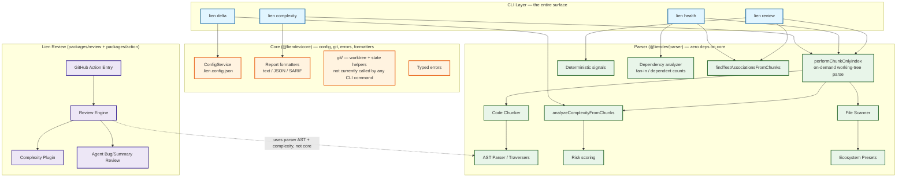

# System Overview

This document provides a high-level overview of Lien's architecture, showing the main components and their relationships.

> [!IMPORTANT]
> **Phase 5 (2026-09-01, commit `0de8ea52`) deleted the MCP server, the persisted
> SQLite index, FTS5 lexical search, the indexer, the file watcher, and `GlobalConfig`.**
> `lien` is no longer a server with a database behind it. It is a CLI that parses
> the working tree on demand (Tree-sitter, via `@liendev/parser`) and answers four
> questions about a change: what is risky to touch (`lien health`), what crossed a
> complexity threshold (`lien delta`), what deterministic signals fire on the diff
> (`lien review`), and where the complexity hotspots are (`lien complexity`). No
> index means no staleness, but also no search and no server for an AI assistant to
> connect to — see [ADR-011](decisions/0011-sqlite-structural-store-fts5-lexical-search.md),
> now superseded, for what this replaced.

## Component architecture


```mermaid
graph TB
    subgraph "CLI Layer — the entire surface"
        COMPLX[lien complexity]
        HEALTH[lien health]
        REVIEW[lien review]
        DELTA[lien delta]
    end

    subgraph "Parser (@liendev/parser) — zero deps on core"
        PARSEIDX[performChunkOnlyIndex<br/>on-demand working-tree parse]
        SCANNER[File Scanner]
        CHUNKER[Code Chunker]
        AST[AST Parser / Traversers]
        COMPLEXANALYZER[analyzeComplexityFromChunks]
        RISK[Risk scoring]
        SIGNALS[Deterministic signals]
        DEPS[Dependency analyzer<br/>fan-in / dependent counts]
        TESTASSOC[findTestAssociationsFromChunks]
        ECOSYSTEM[Ecosystem Presets]
    end

    subgraph "Core (@liendev/core) — config, git, errors, formatters"
        CONFIG[ConfigService<br/>.lien.config.json]
        FORMAT[Report formatters<br/>text / JSON / SARIF]
        GIT[git/ — worktree + state helpers<br/>not currently called by any CLI command]
        ERRORS[Typed errors]
    end

    subgraph "Lien Review (packages/review + packages/action)"
        GHACTION[GitHub Action Entry]
        REVIEWENGINE[Review Engine]
        COMPLEXITYCHECK[Complexity Plugin]
        AGENTREVIEW[Agent Bug/Summary Review]
    end

    %% CLI to Parser
    COMPLX --> PARSEIDX
    HEALTH --> PARSEIDX
    HEALTH --> DEPS
    HEALTH --> TESTASSOC
    REVIEW --> PARSEIDX
    REVIEW --> SIGNALS
    REVIEW --> TESTASSOC
    DELTA --> COMPLEXANALYZER

    %% CLI to Core
    COMPLX --> FORMAT
    DELTA --> CONFIG

    %% Parser internals
    PARSEIDX --> SCANNER
    PARSEIDX --> CHUNKER
    CHUNKER --> AST
    SCANNER --> ECOSYSTEM
    PARSEIDX --> COMPLEXANALYZER
    COMPLEXANALYZER --> RISK

    %% Lien Review — separate product surface, shares only the parser
    %% package (AST + complexity). Does not depend on core.
    GHACTION --> REVIEWENGINE
    REVIEWENGINE --> COMPLEXITYCHECK
    REVIEWENGINE --> AGENTREVIEW
    REVIEWENGINE -.->|uses parser AST + complexity, not core| AST

    %% Styling
    classDef cliClass fill:#e1f5ff,stroke:#01579b,stroke-width:2px
    classDef parserClass fill:#e8f5e9,stroke:#1b5e20,stroke-width:2px
    classDef coreClass fill:#fff3e0,stroke:#e65100,stroke-width:2px
    classDef reviewClass fill:#ede7f6,stroke:#311b92,stroke-width:2px

    class COMPLX,HEALTH,REVIEW,DELTA cliClass
    class PARSEIDX,SCANNER,CHUNKER,AST,COMPLEXANALYZER,RISK,SIGNALS,DEPS,TESTASSOC,ECOSYSTEM parserClass
    class CONFIG,FORMAT,GIT,ERRORS coreClass
    class GHACTION,REVIEWENGINE,COMPLEXITYCHECK,AGENTREVIEW reviewClass
```

## Component descriptions

### CLI layer — the entire surface
- **`lien complexity`**: Parses the working tree and reports cyclomatic/cognitive/Halstead violations. Gate-shaped (`--fail-on`).
- **`lien health`**: Ranks the functions riskiest to change — cognitive complexity × fan-in (dependent count) ÷ test coverage. Advisory; never fails on findings.
- **`lien review`**: Runs the deterministic signals (`packages/parser/src/signals/`) over a diff (working tree vs. `HEAD` or `--base`) and prints candidates for a human/agent to adjudicate. No `--fail-on`, deliberately — see the file header comment in `review-cmd.ts`.
- **`lien delta`**: The sixth pre-commit gate. Compares working tree vs. `HEAD`/`--base` and fails only on a *new* complexity threshold crossing. See [lien delta](./lien-delta.md).

All four read the working tree directly, not a persisted index: `complexity`, `health`, and `review` chunk the whole repo via `performChunkOnlyIndex`; `delta` chunks only the changed files' before/after content via `computeComplexityDelta` (`@liendev/parser`, `insights/complexity-delta.ts`). Either way, there is nothing to keep in sync, because nothing is persisted.

### Parser (`@liendev/parser`)
- **`performChunkOnlyIndex`**: On-demand, in-memory parse of the working tree — the replacement for what used to be a persisted index.
- **File Scanner**: Scans the codebase respecting `.gitignore` and ecosystem preset boundaries.
- **Code Chunker**: Splits files using AST-based semantic chunking, with an internal line-based fallback.
- **AST Parser / Traversers**: Tree-sitter parsing plus per-language traversal (Strategy Pattern).
- **`analyzeComplexityFromChunks`**: Computes cyclomatic, cognitive, and Halstead complexity per function.
- **Risk scoring** (`risk/`): Blast-radius risk (`computeBlastRadiusRisk`) and complexity-based risk leveling.
- **Deterministic signals** (`signals/`): Pure functions over a diff plus parser output — no LLM, no network, no index — that power `lien review`.
- **Dependency analyzer**: Fan-in / dependent-count computation, the basis for `lien health`'s "impact" axis.
- **`findTestAssociationsFromChunks`**: Links source files to the tests that cover them (see [Test Association](./test-association.md)).
- **Ecosystem Presets**: Auto-detects project type (Node.js, PHP/Laravel, Python, Rust, …) and applies include/exclude patterns (replaces the former Framework Detector, see [ADR-007](decisions/0007-replace-framework-detection-with-ecosystem-presets.md)).

### Core (`@liendev/core`)
- **ConfigService**: Loads and validates per-project `.lien.config.json` (`complexity.thresholds` only — see [Configuration System](./config-system.md)). `GlobalConfig` and the storage backend it configured are gone.
- **Report formatters**: text/JSON/SARIF output for `lien complexity`.
- **`git/`**: Worktree detection and git-state helpers survive in the package, but no surviving CLI command currently calls them — `delta-cmd.ts` and `health-cmd.ts` shell out to `git` directly instead. Left in place; not wired to anything today.
- **Typed errors**: `LienError` and error codes shared across commands.

### Lien Review (packages/review + packages/action)
Lien Review is a separate product surface from the CLI above: a self-hostable GitHub Action that reviews pull requests in CI rather than running as a local command.

- **GitHub Action Entry** (`packages/action`): Docker container action; reads the `pull_request` event, self-clones the PR head (and base, for complexity deltas) by SHA, and posts results with no `actions/checkout`, no server, no database.
- **Review Engine** (`packages/review`): Orchestrates the enabled review passes and posts inline PR comments, workflow annotations, and a step summary.
- **Complexity Plugin**: Flags new/worsened cyclomatic, cognitive, and Halstead complexity violations on the diff.
- **Agent Bug/Summary Review**: LLM-driven review (OpenRouter or Anthropic) for correctness bugs, architectural concerns, and a PR summary.

`packages/review` depends on **`@liendev/parser` only**: it does not import `@liendev/core`, so it carries none of the storage-layer dependency weight (this is the point of [ADR-009](decisions/0009-extract-parser-package.md)). See [`packages/action/README.md`](../../packages/action/README.md) for the full setup guide, or the [Lien Review site page](../../packages/site/docs/guide/lien-review.md).

Beyond the main investigation, the agent review can run additional dedicated LLM passes (doc-truth is on by default; two candidate-loop passes exist dark-launched) via a generalized `ReviewPassSpec` executor. See [Agent-Review Pass Architecture](./review-pass-architecture.md) ([ADR-014](decisions/0014-per-rule-candidate-loop-passes.md)).

**Retired**: the earlier hosted-SaaS shape for review, `packages/runner` (a NATS-based review runner) and `platform/` (a Laravel 12 control plane and its K8s infra), was removed in favor of this self-hostable Action.

## Data flow

The system follows a clear data flow pattern:

1. **Configuration** → Read by `lien delta` for `complexity.thresholds` (per-project `ConfigService`; nothing else reads config)
2. **Files** → Scanner → Chunker → Complexity/risk/signal metrics → Report (in memory, on every invocation)
3. **Git diff** (`lien delta`, `lien review`) → before/after content per changed file → per-function or per-signal verdicts

## Design principles

### Single responsibility
Each component has one clear purpose. For example:
- Scanner only finds files
- Chunker only splits content
- Each signal module answers one narrow structural question

### Dependency injection
Commands compose parser primitives as plain function calls rather than through an injected storage seam — there's no interface to inject against any more, now that nothing is persisted:
```typescript
const scan = await performChunkOnlyIndex(rootDir, {});
const report = analyzeComplexityFromChunks(scan.chunks, thresholds);
```

### Layered architecture
- **CLI Layer**: User interface — four commands, no server
- **Parser Layer**: Parsing, chunking, complexity, risk, and signal computation (zero deps on core)
- **Core Layer**: Config, git helpers, typed errors, output formatters

### No persisted state
There is no index, no database, no file watcher, and no background process. Every command parses
what it needs, when it's invoked, and exits. This trades away caching and cross-invocation search
for the guarantee that nothing can ever be stale.

## Technology stack

- **Language**: TypeScript (ESM)
- **CLI**: Commander.js
- **Parsing**: Tree-sitter (via `@liendev/parser`, native binding at `@liendev/parser-native`)
- **Testing**: Vitest
- **Build**: tsup

## Performance characteristics

- **Concurrency**: Configurable parallel file processing (default: 4) during a scan
- **No model load, no index load**: every command starts cold and finishes cold — nothing to warm up, nothing that can go stale
- **Cost is proportional to repo size per invocation**: there's no caching between runs, since there's nothing persisted to cache into

## Scaling considerations

### Current limits
- Single machine, single process, single invocation at a time
- Every run re-parses whatever it needs; there is no cross-invocation cache

### History
Lien used to be a local-first *storage* system — LanceDB + embeddings, then a SQLite structural
store with FTS5 lexical search behind a `VectorDBInterface`/`createVectorDB` seam meant to let a
backend be swapped without touching call sites (see [ADR-010](decisions/0010-retire-qdrant-backend.md),
[ADR-011](decisions/0011-sqlite-structural-store-fts5-lexical-search.md)). Phase 5 deleted the
storage layer entirely rather than swapping it again: there is no seam left to plug a backend into.

See the [Architectural Decision Records index](decisions/README.md) for the full history behind these and earlier design changes (per-language definitions, AST-based chunking, the strategy-pattern traverser, test association detection, ecosystem presets, and the parser package extraction).
