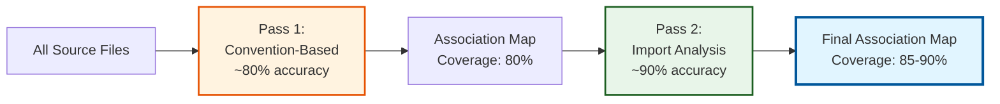
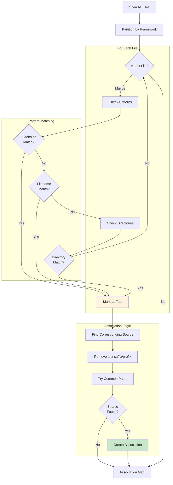
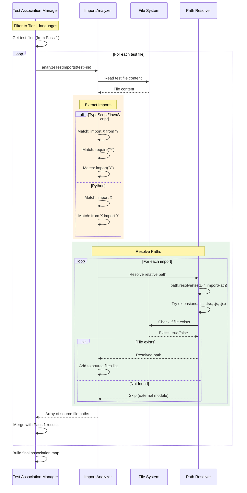
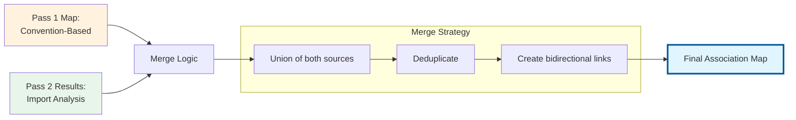
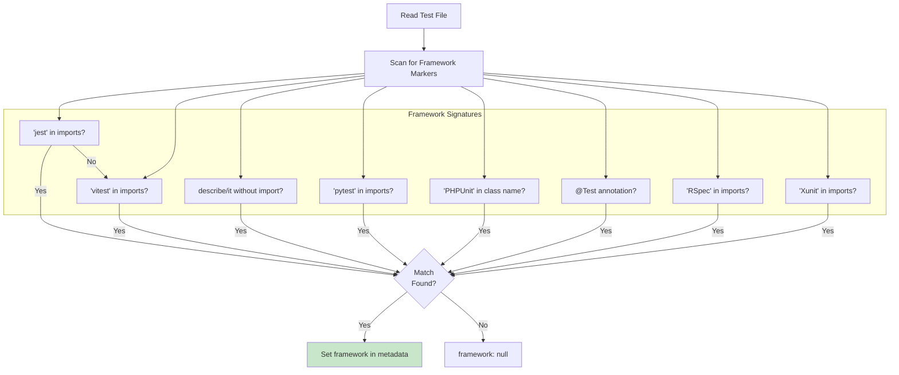

# Test Association Flow

This document describes Lien's two-pass test detection system that links test files to their source files.

## Overview

Test association helps AI assistants understand which tests cover which source code, enabling better code comprehension and test-aware refactoring suggestions.

## Two-Pass Detection Strategy



**Why Two Passes?**

1. **Pass 1 (Convention)**: Fast, language-agnostic, covers 12 languages
2. **Pass 2 (Import)**: Slower, language-specific, more accurate for Tier 1 languages

## Pass 1: Convention-Based Detection



### Pattern Examples

**Extension Patterns:**
```
test.ts   → user.test.ts ✓
spec.js   → auth.spec.js ✓
_test.py  → parser_test.py ✓
Test.java → UserTest.java ✓
```

**Filename Patterns:**
```
PREFIX:
test_user.py  ✓ (prefix: "test_")
test-auth.js  ✓ (prefix: "test-")

SUFFIX:
user_test.py  ✓ (suffix: "_test")
auth.test.ts  ✓ (suffix: ".test")
```

**Directory Patterns:**
```
tests/unit/user.py        ✓ (directory: "tests/")
__tests__/auth.test.ts    ✓ (directory: "__tests__/")
test/integration/api.js   ✓ (directory: "test/")
spec/models/user_spec.rb  ✓ (directory: "spec/")
```

### Source File Resolution

```typescript
// Example: user.test.ts → user.ts

1. Remove test suffix/prefix:
   "user.test.ts" → "user.ts"

2. Try common paths:
   - Same directory: src/__tests__/user.test.ts → src/user.ts
   - Parent directory: tests/user.test.ts → user.ts
   - Sibling directory: tests/unit/user.test.ts → src/user.ts
   - Mirror structure: backend/tests/user.test.ts → backend/src/user.ts

3. Check if file exists:
   fs.access(resolvedPath)

4. If found: Create association
   test: "src/__tests__/user.test.ts"
   source: "src/user.ts"
```

## Pass 2: Import Analysis

Only runs for Tier 1 languages (TypeScript, JavaScript, Python)



### Import Pattern Recognition

**TypeScript/JavaScript:**
```typescript
// ES6 imports
import { User } from './user';               ✓
import * as utils from '../utils';           ✓
import type { Config } from './config';      ✓

// CommonJS
const user = require('./user');              ✓
const { auth } = require('../auth');         ✓

// Dynamic imports
const module = await import('./module');     ✓

// External modules (ignored)
import React from 'react';                   ✗
import { expect } from 'vitest';             ✗
```

**Python:**
```python
# Absolute imports
import user                                  ✓
from auth import login                       ✓

# Relative imports
from . import utils                          ✓
from ..models import User                    ✓

# External modules (ignored)
import pytest                                ✗
from unittest import TestCase                ✗
```

### Path Resolution Algorithm

```typescript
function resolvePath(testFilePath: string, importPath: string): string | null {
  // 1. Get test file directory
  const testDir = path.dirname(testFilePath);
  
  // 2. Resolve relative to test file
  let resolved = path.resolve(testDir, importPath);
  
  // 3. Try common extensions
  for (const ext of ['.ts', '.tsx', '.js', '.jsx', '.py']) {
    const withExt = resolved + ext;
    if (fs.existsSync(withExt)) {
      return withExt;
    }
  }
  
  // 4. Try index files
  for (const index of ['/index.ts', '/index.js']) {
    const indexPath = resolved + index;
    if (fs.existsSync(indexPath)) {
      return indexPath;
    }
  }
  
  // 5. Not found
  return null;
}
```

## Merging Results



### Merge Example

```typescript
// Pass 1 (Convention):
{
  "src/user.ts": {
    relatedTests: ["src/__tests__/user.test.ts"],
    detectionMethod: "convention"
  }
}

// Pass 2 (Import Analysis):
{
  "src/__tests__/user.test.ts": {
    relatedSources: ["src/user.ts", "src/utils.ts"], // Found via imports
    detectionMethod: "import"
  }
}

// Merged:
{
  "src/user.ts": {
    relatedTests: ["src/__tests__/user.test.ts"],
    detectionMethod: "convention+import"
  },
  "src/utils.ts": {
    relatedTests: ["src/__tests__/user.test.ts"],
    detectionMethod: "import"  // New discovery!
  },
  "src/__tests__/user.test.ts": {
    isTest: true,
    relatedSources: ["src/user.ts", "src/utils.ts"],
    testFramework: "vitest",
    detectionMethod: "convention+import"
  }
}
```

## Framework Detection

Test frameworks are detected from file content:



## Metadata Enrichment

Once associations are built, metadata is added to each code chunk:

```typescript
interface ChunkMetadata {
  file: string;
  startLine: number;
  endLine: number;
  language: string;
  
  // Test association metadata:
  isTest?: boolean;                    // Is this chunk from a test file?
  relatedTests?: string[];             // For source files: which tests cover this?
  relatedSources?: string[];           // For test files: which sources are tested?
  testFramework?: string;              // jest, vitest, pytest, etc.
  detectionMethod?: 'convention' | 'import' | 'convention+import';
  
  symbols?: {
    functions: string[];
    classes: string[];
    interfaces: string[];
  };
}
```

## Performance Characteristics

### Pass 1 (Convention-Based)

```
1,000 files, mixed languages
Time: ~2-3 seconds
Coverage: ~80% accuracy
Memory: Minimal (Map<string, TestAssociation>)
```

### Pass 2 (Import Analysis)

```
250 test files (TypeScript/JavaScript/Python only)
Average 5 imports per test
Time: ~2 seconds
Coverage: ~90% accuracy for analyzed files
Memory: Moderate (parses file contents)
```

### Combined

```
Total time: ~5 seconds
Overall coverage: 85-90% accuracy
Supported languages: 12 (Pass 1), 3 (Pass 2)
```

## Language Support Matrix

| Language | Pass 1 (Convention) | Pass 2 (Import) | Test Frameworks Detected |
|----------|:-------------------:|:---------------:|-------------------------|
| TypeScript | ✅ | ✅ | Jest, Vitest, Mocha |
| JavaScript | ✅ | ✅ | Jest, Vitest, Mocha |
| Python | ✅ | ✅ | pytest, unittest |
| Go | ✅ | ❌ | Go test |
| Rust | ✅ | ❌ | Cargo test |
| Java | ✅ | ❌ | JUnit, TestNG |
| C# | ✅ | ❌ | xUnit, NUnit |
| PHP | ✅ | ❌ | PHPUnit |
| Ruby | ✅ | ❌ | RSpec, Minitest |
| C/C++ | ✅ | ❌ | GoogleTest |
| Scala | ✅ | ❌ | ScalaTest |
| Kotlin | ✅ | ❌ | JUnit, Kotest |

## Real-World Example

### Input Files

```
project/
├── src/
│   ├── user.ts                (Source)
│   ├── auth.ts                (Source)
│   └── utils.ts               (Source)
└── tests/
    └── unit/
        └── user.test.ts       (Test)
```

**user.test.ts:**
```typescript
import { describe, it, expect } from 'vitest';
import { User } from '../../src/user';
import { hashPassword } from '../../src/auth';

describe('User', () => {
  it('creates user with hashed password', () => {
    // ...
  });
});
```

### Pass 1 Results

```typescript
{
  "src/user.ts": {
    relatedTests: ["tests/unit/user.test.ts"],
    detectionMethod: "convention"
  },
  "tests/unit/user.test.ts": {
    isTest: true,
    relatedSources: ["src/user.ts"],  // Guessed from filename
    testFramework: "vitest",
    detectionMethod: "convention"
  }
}
```

### Pass 2 Discovers More

```typescript
{
  "src/user.ts": {
    relatedTests: ["tests/unit/user.test.ts"],
    detectionMethod: "convention+import"
  },
  "src/auth.ts": {  // NEW! Found via import analysis
    relatedTests: ["tests/unit/user.test.ts"],
    detectionMethod: "import"
  },
  "tests/unit/user.test.ts": {
    isTest: true,
    relatedSources: ["src/user.ts", "src/auth.ts"],  // Both discovered
    testFramework: "vitest",
    detectionMethod: "convention+import"
  }
}
```

### User Benefit

When AI assistant asks about `src/auth.ts`:

```
> "What tests cover this authentication module?"

Lien response:
- tests/unit/user.test.ts (imports hashPassword function)
- Detection method: Import analysis
- Framework: Vitest
```

## Error Handling

### Graceful Degradation

```typescript
try {
  // Pass 1: Always runs
  const conventionAssociations = buildConventionBasedAssociations(files);
  
  try {
    // Pass 2: May fail for some files
    const importAssociations = await analyzeImports(testFiles);
    return mergeAssociations(conventionAssociations, importAssociations);
  } catch (error) {
    console.warn('Import analysis failed, using convention-based only');
    return conventionAssociations;  // Fall back to Pass 1
  }
} catch (error) {
  console.warn('Test association failed, continuing without associations');
  return new Map();  // Empty map, indexing continues
}
```

### File-Level Errors

```typescript
// Skip problematic files, continue with others
for (const testFile of testFiles) {
  try {
    const sources = await analyzeTestImports(testFile);
    associations.set(testFile, sources);
  } catch (error) {
    console.warn(`Failed to analyze ${testFile}: ${error.message}`);
    // Continue with next file
  }
}
```

## Future Enhancements

### Planned Improvements

1. **Tree-sitter parsing**: More accurate import extraction
2. **Caching**: Save associations between runs
3. **Confidence scores**: Rate association quality
4. **User overrides**: Manual association configuration
5. **More languages**: Expand Pass 2 to Go, Java, etc.

### Requested Features

- Association visualization
- Orphaned test detection
- Coverage gap reporting
- Test impact analysis (which tests to run for a change)

